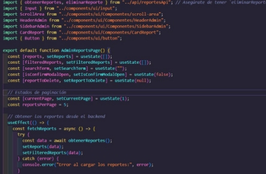
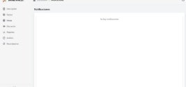
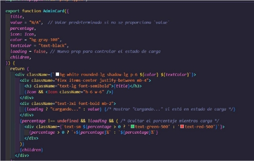
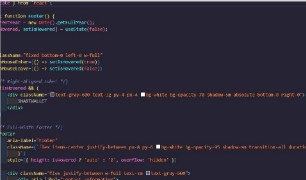

FrontEnd

Documentaci6n del Frontend de Smart Wallet

1\. Estructura del Proyecto

El proyecto está estructurado en varias carpetas y archivos que organizan las diferentes funcionalidades y componentes del sistema. A continuaci6n, se presenta la estructura principal:

- src/: Contiene todos los archivos fuente de la aplicaci6n.
  - api/: Archivos que manejan la comunicaci6n con la API.
    - categoriasApi.jsx: Maneja las solicitudes relacionadas con las categorías.
    - gastosApi.jsx: Maneja las solicitudes relacionadas con los gastos.
    - metasApi.jsx: Maneja las solicitudes relacionadas con las metas de ahorro.
    - notificacionesApi.jsx: Maneja las solicitudes relacionadas con las notificaciones.
    - recordatoriosApi.jsx: Maneja las solicitudes relacionadas con los recordatorios.
    - reportesApi.jsx: Maneja las solicitudes relacionadas con los reportes.
    - usuariosApi.jsx: Maneja las solicitudes relacionadas con los usuarios.

assets/: Contiene imágenes y archivos estáticos utilizados en la aplicaci6n.

- fonfo.jpg: Imagen de fondo.
- Logo.png: Logo de la aplicaci6n.
- Noticia1.jpg, Noticia2.jpg: imágenes de noticias.
- react.svg: icono de React.

FrontEnd

Dentro de la carpeta de Componenets nos podemos encontrar con múltiples carpetas las cuales cuentan con componen entes para crear la interfaz de usuario, dentro de estas carpetas se encuentran la carpeta de Componentes, Modales, Charts y Protected.Esta es la estructura que se muestra a continuación

FrontEnd

La carpeta pages contiene componentes que representan diferentes páginas de la aplicaci6n Smart Wallet. Cada uno de estos componentes se encarga de una funcionalidad especifica y presenta la interfaz de usuario correspondiente.

Descripci6n de Componentes

1\. AboutSection.jsx

- Descripci6n: Componente que muestra informaci6n sobre el proyecto Smart Wallet, sus objetivos y su prop6sito.
- `	`Uso: Este componente se puede incluir en la página principal o en secciones informativas.

Archive: AboutSection.jsx

Este componente de React representa una secci6n de "Sobre Nosotros" para la página de una aplicaci6n llamada SmartWallet. incluye un encabezado con fondo de imagen, una descripci6n general de la empresa y tarjetas interactivas que detallan la misi6n, la historia y la estructura de liderazgo de la empresa. Cada tarjeta contiene un bot6n que abre un modal con más informaci6n.

Dependencias

- React: Librera para la creaci6n de interfaces de usuario.
- PropTypes: Verifica los tipos de datos de las props pasadas a los componentes.
- `	`react-router-dam: Proporciona la navegaci6n entre páginas en aplicaciones de React.
- lucide-react: Biblioteca de iconos de React.
- framer-motion: Biblioteca para animaciones y transiciones en React.
- Componentes personalizados:
  - Navbar: Barra de navegaci6n.
  - lnfoModal: Modal para mostrar informaci6n detallada.
  - Footer: Pie de página.

Estructura del Componente AboutSection

1. Navbar: Componente de la barra de navegaci6n que se muestra en la parte superior.
1. Secci6n de Encabezado:

   0. Un contenedor animado con una imagen de fondo y un título.
1. Contenido Principal:

   0. Un contenedor con tarjetas (AboutCard), cada una representando una parte clave de la empresa.
1. Footer: Componente de pie de página al final de la secci6n. Propiedades y Funcionalidades del Componente AboutCard

   0. icon: Prop que recibe un icono JSX para representar visualmente el tema de la tarjeta.
   0. title: Prop que representa el título de la tarjeta.
   0. description: Prop que contiene una breve descripci6n de la informaci6n de la tarjeta.
   0. modalContent: Prop que contiene el contenido detallado que se muestra en el modal al hacer clic en el bot6n.

Comportamiento de la Tarjeta

0. Cada tarjeta se anima al aparecer en la página mediante framer-motion.
0. Tiene un bot6n que, al hacer clic, abre un modal (lnfoModal) con informaci6n más detallada.
0. La tarjeta y el modal están diseñados con estilos de Tailwind CSS. Modal lnfoModal
0. Este modal se muestra al usuario al hacer clic en "Mas informaci6n" en una tarjeta.
0. isOpen: Estado de visibilidad del modal.
0. onClose: Funci6n que cierra el modal.
0. title y content: Props que definen el título y contenido del modal, respectivamente

FrontEnd

AdminOverviewPage.jsx

0. Descripci6n: Pagina de administraci6n que proporciona un resumen de las estadísticas y datos relevantes para los administradores.
0. Uso: Permite a los administradores obtener una visión general de la actividad de la aplicaci6n.

Archivo: AdminOverviewPage.jsx

Este componente de React muestra una página de vista general para los administradores, proporcionando métricas clave sabre los usuarios registrados y una gráfica que visualiza el registro de usuarios por mes. incluye un diseño dividido con una barra lateral, encabezado y un área principal que muestra tarjetas de métricas y gráficos.

Dependencias

0. React: Usa hooks (useState, useEffect) para gestionar el estado y cargar datos asíncronamente.
0. obtenerlnfoUsuarios: Funci6n importada desde usuariosApi que obtiene datos de usuarios desde una API.
0. SidebarAdmin: Componente de barra lateral para navegaci6n.
0. HeaderAdmin: Componente de encabezado para la vista del administrador.
0. recharts: Biblioteca de gráficos utilizada para crear un gráfico de líneas.
0. AdminCard: Componente de tarjeta que muestra métricas y gráficos. Estado del Componente
0. usuariosRegistrados: Almacena el total de usuarios registrados.
0. usuariosRegistradosMes: Almacena el número de usuarios registrados en el mes actual.
0. graficaData: Datos para el grafico de líneas de usuarios registrados mensualmente.
0. loading: Estado booleano que indica si los datos están en proceso de carga. useEffect

   Utilizado para cargar los datos de usuarios al montar el componente. La funci6n asíncrona fetchData llama a obtenerlnfoUsuarios y actualiza los estados usuariosRegistrados, usuariosRegistradosMes, y graficaData con la informaci6n obtenida de la API. Maneja errores de carga y actualiza el estado de loading una vez que los datos están listos o ha ocurrido un error.

   Renderizado Principal

1. SidebarAdmin: Barra lateral fija para navegaci6n del administrador.
1. HeaderAdmin: Encabezado que proporciona contexto y herramientas adicionales para la administraci6n.
1. Título: Encabezado principal de la página ("Dashboard").
1. Tarjetas de Métricas:

   0. Usuarios Registrados: Tarjeta que muestra el total de usuarios registrados.
   0. Usuarios Registrados este Mes: Tarjeta que muestra el número de usuarios registrados en el mes actual.
1. Gráfico de Usuarios:

   0. Utiliza ResponsiveContainer de recharts para un gráfico adaptable que muestra la evoluci6n de usuarios registrados por mes.
   0. El grafico de líneas (LineChart) incluye XAxis, YAxis, Tooltip, y una cuadricula (CartesianGrid) para mejorar la visualizaci6n de los datos.
   0. La línea muestra el número de usuarios registrados cada mes (dataKey="value"). Componentes y Propiedades del Grafico
- ResponsiveContainer: Asegura que el grafico se ajuste al contenedor.
- LineChart: Grafico de líneas que utiliza graficaData coma fuente de datos.
- `	`XAxis y YAxis: Ejes que indican los datos de meses y el número de usuarios, respectivamente.
- Tooltip: Muestra detalles al pasar el cursor sabre un punto en el gráfico.
- 	Line: Representa la serie de datos en el gráfico, con estilo personalizado y puntos interactivos.

FrontEnd

Archive: AdminReportsPage.jsx

Este componente de React representa una página de administraci6n para gestionar reportes. Permite a los administradores ver, buscar, paginar y eliminar reportes de la base de datos a través de una interfaz interactiva.

Dependencias

- React: Utiliza los hooks useState y useEffect para gestionar el estado y manejar la carga de datos de manera asíncrona.
- obtenerReportes, eliminarReporte: Funciones importadas de reportesApi para obtener y eliminar reportes del backend.
- Input: Componente de entrada personalizado.
- ScrollArea: Componente de área de desplazamiento para mostrar una lista de reportes.
- HeaderAdmin, SidebarAdmin: Componentes de UI que representan el encabezado y la barra lateral de la página de administraci6n.
- CardReport: Componente para mostrar la informaci6n de cada reporte.
- Button: Componente de bot6n personalizado. Estado del Componente
- reports: Arreglo que contiene todos los reportes cargados desde el backend.
- filteredReports: Arreglo que contiene los reportes filtrados en funci6n de la búsqueda.
- searchTerm: Cadena de texto que representa el termino de búsqueda ingresado por el usuario.
- isConfirmModalOpen: Booleano que indica si el modal de confirmaci6n de eliminaci6n está abierto.
- reportToDelete: ID del reporte que se va a eliminar.
- currentPage: Numero de página actual para la paginaci6n.
- reportsPerPage: Cantidad de reportes mostrados por página.
- totalPages: Número total de páginas calculadas. useEffect

  Llama a la funci6n fetchReports cuando el componente se manta para cargar los reportes desde el backend. La funci6n maneja la carga de datos y captura errores en caso de fallos en la solicitud.

  Funcionalidades Principales

1. Buscar Reportes:

   0. `	`La funci6n handleSearch filtra los reportes basándose en el término de búsqueda ingresado.
   0. Reinicia la página a la primera cuando se realiza una búsqueda.
1. Abrir y Cerrar Modal de Confirmaci6n:

   0. `	`openConfirmModal: Abre el modal de confirmaci6n de eliminaci6n y establece el ID del reporte a eliminar.
   0. closeConfirmModal: Cierra el modal y limpia el estado reportToDelete.
1. Eliminar Reporte:

   0. La funci6n handleDelete envía una solicitud al backend para eliminar el reporte especificado.
   0. Actualiza el estado reports y filteredReports para reflejar la eliminaci6n en la UI.
1. Paginaci6n:

   0. Determina el rango de reportes que se muestran en funci6n de la página actual (current Page).
   0. La funci6n pagínate actualiza currentPage al número de página seleccionado.

FrontEnd

Renderizado Principal

- SidebarAdmin: Muestra la barra lateral de navegaci6n.
- HeaderAdmin: Muestra el encabezado de la página.
- Barra de búsqueda: Permite al usuario buscar reportes par título.
- Lista de Reportes:
  - Usa ScrollArea para una lista desplazable de reportes.
  - Muestra cada reporte con el componente CardReport, que incluye el título, descripci6n, fecha de creaci6n y un bot6n para eliminar.
- Paginaci6n: Botones numerados para cambiar de página.
- Modal de Confirmaci6n:
  - `	`Aparece al intentar eliminar un reporte, mostrando opciones para confirmar o cancelar la acci6n.

interactividad

- Los botones de paginaci6n permiten la navegaci6n entre páginas de reportes.
- El modal confirma si el usuario quiere proceder con la eliminaci6n del reporte seleccionado.
- El componente Button maneja la acci6n de eliminar o cancelar dentro del modal.

FrontEnd

Archive: AnalysisPage.jsx

Este componente de React representa una página de análisis financiero que muestra gráficos interactivos para visualizar el estado financiero del usuario, incluyendo ingresos, gastos y progreso en las metas. La página se compone de varios gráficos que permiten al usuario ver la distribuci6n de gastos, gastos por categoría, comparaci6n de ingresos y gastos, y el progreso de sus metas financieras.

Dependencias

- React: Utiliza los hooks useState, useEffect, y useContext para manejar el estado y la carga de datos asíncrona.
- AuthContext: Contexto de autenticaci6n para obtener el token de usuario.
- Sidebar, Header: Componentes de interfaz de usuario para la barra lateral y el encabezado de la página.
- CategoryExpensesChart, ExpensesDistributionChart, lncomeExpensesPieChart, GoalProgressChart: Componentes de gráficos para mostrar los datos financieros.
- `	`obtenerlngresoUsuario, obtenerGastosPorUsuario, obtenerMetasPorUsuario: Funciones importadas de las APls para obtener datos de ingreso, gastos y metas del usuario.

Estado del Componente

- income: Estado que almacena el ingreso total del usuario.
- totalExpenses: Estado que almacena el monto total de gastos del usuario.
- expenseData: Datos formateados para el grafico de distribuci6n de gastos.
- expenseCategories: Datos de las categorfas de gastos con sus respectivos montos.
- `	`goals: Arreglo que contiene las metas financieras del usuario, cada una con su nombre, monto objetivo y monto alcanzado.

Funciones Principales

- parseJwt: Decodifica el token JWT para extraer el usuario\_id del payload.
- fetchlncome: Funci6n asíncrona que obtiene el ingreso del usuario y actualiza el estado income.
- fetchExpenses: Funci6n asíncrona que obtiene los gastos del usuario y:
  - Calcula el total de gastos y actualiza totalExpenses.
  - `	`Agrupa los gastos por categoría, calcula los montos por categoría y actualiza expenseCategories y expenseData.
- fetchGoals: Funci6n asíncrona que obtiene las metas del usuario y las convierte a un formato adecuado para el grafico de progreso. Actualiza el estado goals.

Ciclo de Vida (useEffect)

El useEffect se ejecuta al montar el componente y cuando cambian token o usuario\_id. Llama a fetchlncome, fetchExpenses y fetchGoals para obtener y actualizar los datos necesarios si el usuario\_id está disponible.

Renderizado Principal

1. Sidebar: Componente de barra lateral para la navegaci6n.
1. Header: Componente de encabezado de la página.
1. Título: Encabezado "Análisis Financiero" en la secci6n principal.
1. Gráficos:

   0. Gastos por Categoría: Muestra un gráfico de barras o de otro tipo con las categorfas de gasto más relevantes.
   0. Distribuci6n de Gastos: Grafico que representa la distribuci6n de gastos en diferentes categorfas.
   0. Comparaci6n de ingresos vs Gastos: Grafico de pastel que compara el ingreso total con el gasto total.
   0. Progreso de Metas: Muestra un gráfico de progreso de las metas financieras del usuario. Si no hay metas, se muestra un mensaje indicándolo.

FrontEnd

Comportamiento de los Gráficos

- CategoryExpensesChart: Muestra las categorfas de gastos y los montos relacionados.
- ExpensesDistributionChart: Representa c6mo se distribuyen los gastos del usuario en las diferentes categorfas.
- lncomeExpensesPieChart: Compara visualmente el ingreso total del usuario con el total de gastos.
- GoalProgressChart: indica el progreso hacia las metas financieras; si no hay metas, se presenta un texto alternative.

Este componente proporciona una vista centralizada y detallada del estado financiero del usuario mediante gráficos interactivos y actualizados, brindando una manera eficiente de analizar ingresos, gastos y progreso en las metas.

FrontEnd

Archivo: EducationAdminPage.jsx

Este componente de React representa una página de administraci6n de educaci6n que muestra artículos relacionados con temas financieros, cargados desde una API externa. Permite a los administradores visualizar noticias para mantenerse informados y actualizados sobre el sector financiero.

Dependencias

- React: Utiliza los hooks useState y useEffect para gestionar el estado y manejar la carga de datos de manera asíncrona.
- Button: Componente de bot6n personalizado.
- ScrollArea: Componente para mostrar el contenido con área de desplazamiento.
- HeaderAdmin, SidebarAdmin: Componentes de interfaz de usuario que representan el encabezado y la barra lateral de la página de administraci6n.
- CardEducation: Componente para mostrar cada artículo de educaci6n con detalles como título, descripci6n, imagen, fecha de publicaci6n y autor.
- fetchArticles: Funci6n importada de newsAPI para obtener los artículos desde una API externa.

Estado del Componente

- articles: Arreglo que contiene los artículos obtenidos de la API.
- loading: Booleano que indica si los datos están en proceso de carga. useEffect

  El useEffect se ejecuta al montar el componente para cargar los artículos. La funci6n getArticles llama a fetchArticles con la categoría "finance" y actualiza el estado articles con los datos obtenidos. Maneja posibles errores en la carga y actualiza el estado loading una vez que la solicitud ha finalizado.

  Funcionalidades Principales

- Carga de Artfculos:
  - Utiliza fetchArticles para obtener artículos relacionados con temas financieros.
  - `	`Actualiza el estado articles con la respuesta de la API y controla el estado de carga (loading).

Renderizado Principal

1. SidebarAdmin: Componente de barra lateral de navegaci6n.
1. HeaderAdmin: Componente de encabezado de la página.
1. Título: Encabezado de la secci6n "Educaci6n" que introduce la página.
1. Area de Contenido Desplazable:

   0. Utiliza ScrollArea para mostrar la lista de artículos con desplazamiento.
   0. Si loading es true, se muestra un mensaje de carga.
   0. Cuando loading es false, se mapea el estado articles y se renderiza cada artículo con CardEducation, mostrando informaci6n como título, descripci6n, imagen, fecha de publicaci6n y autor.
   0. Si no hay descripci6n o autor, se muestra un mensaje por defecto. Comportamiento del Componente CardEducation
   0. title: Muestra el título del artículo.
   0. description: Muestra la descripci6n del artículo o un mensaje predeterminado si no está disponible.
   0. imagen: Muestra la imagen asociada al artículo.
   0. timeAgo: Muestra el tiempo transcurrido desde la publicaci6n del artículo.
   0. autor: indica el autor del artículo o "Desconocido" si no se proporciona.
   0. url: Proporciona un enlace al artículo completo.

FrontEnd

Archivo: EducationPage.jsx

Este componente de React representa una página de educaci6n que muestra artículos relacionados con temas financieros, obtenidos de una API externa. Ofrece a los usuarios una forma de visualizar contenido educativo sobre finanzas en un formato atractivo y fácil de navegar.

Dependencias

0. React: Utiliza los hooks useState y useEffect para manejar el estado y realizar la carga de datos de forma asíncrona.
0. ScrollArea: Componente que proporciona un área de desplazamiento para mostrar listas largas de contenido.
0. Header, Sidebar: Componentes de la interfaz de usuario que representan el encabezado y la barra lateral de la página.
0. CardEducation: Componente que muestra la informaci6n de cada artículo de educaci6n, incluyendo título, descripci6n, imagen, fecha de publicaci6n, autor, y un enlace al artículo completo.
0. fetchArticles: Funci6n importada de newsAPI para obtener artículos de noticias desde una API externa.

Estado del Componente

0. articles: Arreglo que contiene los artículos obtenidos de la API.
0. loading: Booleano que indica si los datos están en proceso de carga. useEffect

   El useEffect se ejecuta al montar el componente para cargar los artículos. La funci6n getArticles llama a fetchArticles con la categoría "finance" y actualiza el estado articles con la respuesta de la API. Maneja errores durante la carga y actualiza el estado loading una vez que la solicitud se completa, ya sea con éxito o con error.

   Funcionalidades Principales

0. Carga de Artfculos:

   0. Utiliza fetchArticles para obtener artículos relacionados con finanzas.
   0. Actualiza el estado articles con la informaci6n obtenida de la API.
   0. Controla el estado de carga con el booleano loading para mostrar un mensaje de carga mientras los datos se obtienen.

Renderizado Principal

1. Sidebar: Componente de barra lateral para la navegaci6n.
1. Header: Componente de encabezado de la página.
1. Título: Encabezado de la secci6n "Educaci6n" que introduce la página.
1. Area de Contenido Desplazable:

   0. Utiliza ScrollArea para mostrar los artículos en un área con desplazamiento.
   0. Si loading es true, muestra un mensaje de carga.
   0. `	`Cuando loading es false, mapea el estado articles para renderizar cada artículo con CardEducation, mostrando informaci6n relevante como título, descripci6n, imagen, autor, y la fecha de publicaci6n.
   0. Si no se proporciona una descripci6n o autor, se muestra un texto predeterminado.

Comportamiento del Componente CardEducation

- title: Muestra el título del artículo.
- description: Muestra la descripci6n del artículo o un mensaje por defecto si no está disponible.
- image: Muestra la imagen asociada al artículo.
- timeAgo: Muestra la fecha de publicaci6n del artículo.
- author: lndica el autor del artículo o "Desconocido" si no se proporciona.
- url: Proporciona un enlace al artículo completo.

FrontEnd

Archivo: ExpenseCategories.jsx

Este componente de React permite la gesti6n de categorfas de gasto, donde los administradores pueden visualizar, agregar, editar y eliminar categorfas. Proporciona una interfaz interactiva con una tabla y modales para facilitar la gesti6n de datos.

Dependencias

- React: Utiliza los hooks useState y useEffect para manejar el estado y realizar operaciones asíncronas.
- lucide-react: Biblioteca de iconos que se utiliza para mostrar iconos de acciones (e.g., agregar, editar, eliminar).
- HeaderAdmin, SidebarAdmin: Componentes de la interfaz de usuario que representan el encabezado y la barra lateral de la página de administraci6n.
- Button: Componente de bot6n personalizado.
- `	`Table, TableBody, TableCell, TableHead, TableHeader, TableRow: Componentes para crear tablas personalizadas.
- obtenerCategoriasGasto, crearCategoriaGasto, actualizarCategoriaGasto, eliminarCategoriaGasto: Funciones importadas de categoriasApi para realizar operaciones CRUD en categorfas de gasto.
- `	`getlconForCategory: Funci6n de utilidad para obtener un icono representativo de una categoría.
- `	`AddCategoryModal: Componente de modal para agregar una nueva categoría de gasto.

Estado del Componente

- categories: Arreglo que contiene las categorfas de gasto obtenidas de la API.
- isAddModalOpen: Booleano que indica si el modal para agregar una nueva categoría está abierto.
- editingCategory: Objeto que representa la categoría que está siendo editada actualmente.
- confirmDelete: ID de la categoría que está a punto de ser eliminada para confirmar la acci6n.

useEffect

El useEffect se ejecuta al montar el componente para cargar las categorfas de gasto llamando a la funci6n fetchCategories. La funci6n captura posibles errores en la carga de datos y actualiza el estado categories con la informaci6n obtenida de la API. Funcionalidades Principales

- `	`fetchCategories: Carga las categorfas de gasto desde la API y actualiza el estado categories.
- handleAddCategory: Agrega una nueva categoría llamando a la API y actualiza la lista de categorfas al finalizar.
- `	`startEditing: Establece la categoría que está siendo editada y permite la edici6n en línea.
- saveCategory: Guarda los cambios en una categoría editada enviando la actualizaci6n a la API y recarga las categorfas.
- deleteCategory: Elimina una categoría específica de la lista llamando a la API y actualiza el estado para reflejar la eliminaci6n.
- setConfirmDelete: Muestra un conjunto de botones de confirmaci6n y cancelaci6n antes de realizar la eliminaci6n.

FrontEnd

Renderizado Principal

1. SidebarAdmin: Componente de barra lateral para la navegaci6n.
1. HeaderAdmin: Componente de encabezado de la página.
1. Bot6n Agregar Categorfa:

   0. Permite abrir un modal para agregar una nueva categoría.
   0. Muestra un icono de Plus y un texto de acci6n.
1. Tabla de Categorfas:

   0. Muestra una lista de categorfas con columnas para icono, nombre y acciones.
   0. Las acciones incluyen botones para editar (Pencil) y eliminar (Trash2).
1. Edición en Unea:

   0. Permite editar el nombre de la categoría directamente en la tabla.
   0. Los cambios se confirman con la tecla Enter o se cancelan hacienda clic en un bot6n **(X).**
1. Confirmaci6n de Eliminaci6n:

   0. Muestra botones de confirmaci6n (Check) y cancelaci6n (X) cuando se solicita la eliminaci6n de una categoría.
1. Modal de Agregar Categorfa:

   0. Se abre al hacer clic en el bot6n de agregar y permite al usuario ingresar un nuevo nombre de categoría.

Comportamiento del Componente AddCategoryModal

- isOpen: Controla la visibilidad del modal.
- onClose: Funci6n que se ejecuta al cerrar el modal.
- onSave: Funci6n que se ejecuta al guardar la nueva cate

FrontEnd

Archivo: ExpensesPage.jsx

Este componente de React representa una página de gesti6n de gastos donde los usuarios pueden ver una lista de gastos y agregar nuevos gastos mediante un modal interactivo.

Dependencias

- React: Utiliza el hook useState para manejar el estado del componente.
- lucide-react: Biblioteca de iconos que se utiliza para mostrar el icono de agregar (Plus).
- Gastoslist: Componente que muestra la lista de gastos registrados.
- Header, Sidebar: Componentes de la interfaz de usuario que representan el encabezado y la barra lateral de la página.
- AddExpenseModal: Componente de modal para agregar un nuevo gasto. Estado del Componente
- isModalOpen: Booleano que indica si el modal para agregar un nuevo gasto está abierto.
- refreshExpenses: Booleano utilizado para indicar cuando se debe refrescar la lista de gastos después de que se ha agregado un nuevo gasto.

Funcionalidades Principales

- openModal: Funci6n que establece isModalOpen en true, abriendo el modal.
- closeModal: Funci6n que establece isModalOpen en false, cerrando el modal.
- handleExpenseAdded: Funci6n que se ejecuta cuando se agrega un nuevo gasto, cerrando el modal y actualizando el estado refreshExpenses para refrescar la lista de gastos.

Renderizado Principal

1. Sidebar: Componente de barra lateral para la navegaci6n.
1. Header: Componente de encabezado de la página.
1. Secci6n Principal:

   0. `	`Título: Muestra "Ultimas gastos registrados" como encabezado de la secci6n de contenido.
   0. Bot6n Agregar Gasto:

      0. Muestra un bot6n estilizado con un icono de Plus y texto de "Agregar Gasto".
      0. Al hacer clic, abre el modal de adici6n de gasto (AddExpenseModal).
1. Gastoslist:

   0. Muestra una lista de gastos registrados.
   0. Se actualiza cuando refreshExpenses cambia, reflejando nuevos datos cuando se agrega un gasto.
1. AddExpenseModal:

   0. Modal para agregar un nuevo gasto.
   0. Controlado por isModalOpen para abrir o cerrar.
   0. Dispara handleExpenseAdded al agregar un nuevo gasto, refrescando la lista de gastos y cerrando el modal.

Comportamiento del Componente AddExpenseModal

- isOpen: Controla si el modal esta visible o no.
- onClose: Funci6n que se ejecuta al cerrar el modal.
- onExpenseAdded: Funci6n que se ejecuta cuando se confirma la adici6n de un gasto, provocando un refresco de la lista.

FrontEnd

Archivo: GoalsManagement.jsx

Este componente de React permite la gesti6n de categorfas de metas, proporcionando una interfaz para visualizar, agregar, editar y eliminar categorfas de metas a través de una tabla interactiva y un modal para la adici6n de nuevas categorfas.

Dependencias

- React: Utiliza las hooks useState y useEffect para manejar el estado y realizar operaciones asíncronas.
- lucide-react: Biblioteca de iconos utilizada para mostrar iconos de acciones coma agregar, editar y eliminar (Plus, Pencil, Trash2, Check, X).
- HeaderAdmin, SidebarAdmin: Componentes de interfaz de usuario para el encabezado y la barra lateral de la página de administraci6n.
- Button: Componente de bot6n personalizado.
- `	`Table, TableBody, TableCell, TableHead, TableHeader, TableRow: Componentes de tabla para mostrar y gestionar las categorfas de metas.
- obtenerCategoriasMeta, crearCategoriaMeta, actualizarCategoriaMeta, eliminarCategoriaMeta: Funciones importadas de categoriasApi para realizar operaciones CRUD en categorfas de metas.
- `	`getlconForCategory: Funci6n de utilidad para obtener un icono representativo de una categoría.
- AddGoalModal: Componente de modal para agregar una nueva categoría de meta. Estado del Componente
- goals: Arreglo que contiene las categorfas de metas obtenidas de la API.
- isAddModalOpen: Booleano que indica si el modal de agregar nueva meta está abierto.
- editingGoal: Objeto que representa la meta que está siendo editada actualmente.
- confirmDelete: ID de la meta que está a punto de ser eliminada para confirmar la acci6n.

useEffect

El useEffect se ejecuta al montar el componente, llamando a fetchGoals para cargar las categorfas de metas desde la API. Maneja errores durante la carga y actualiza el estado goals con la respuesta de la API.

Funcionalidades Principales

- fetchGoals: Obtiene las categorfas de metas desde la API y actualiza el estado goals.
- handleAddGoal: Agrega una nueva meta llamando a la API y recarga la lista de metas, cerrando el modal al finalizar.
- startEditing: Establece la meta que está en edici6n para permitir la edici6n en línea.
- `	`saveGoal: Guarda las cambios realizados a una meta llamando a la API y recarga la lista de metas.
- deleteGoal: Elimina una meta llamando a la API y actualiza el estado goals para reflejar la eliminaci6n.
- setConfirmDelete: Controla el estado para mostrar opciones de confirmaci6n y cancelaci6n antes de eliminar una meta.

Renderizado Principal

1. SidebarAdmin: Componente de barra lateral para la navegaci6n.
1. HeaderAdmin: Componente de encabezado de la página.
1. Bot6n Agregar Meta:

   0. Abre el modal AddGoalModal para agregar una nueva categoría de meta.
   0. Muestra un icono de Plus y un texto de "Agregar Meta".
1. Tabla de Metas:

   0. Muestra una lista de categorfas de metas con columnas para icono, nombre y acciones.
   0. Las acciones incluyen botones para editar (Pencil) y eliminar (Trash2).
1. Edici6n en Línea:

   0. Permite editar el nombre de una categoría de meta directamente en la tabla.
   0. Los cambios se confirman con la tecla Enter o se cancelan hacienda clic en un bot6n (X).

FrontEnd

1. Confirmaci6n de Eliminaci6n:

   0. Muestra botones de confirmaci6n (Check) y cancelaci6n (X) cuando se solicita la eliminaci6n de una categoría de meta.
1. Modal de Agregar Meta:

   0. Se abre al hacer clic en el bot6n de agregar y permite al usuario ingresar un nuevo nombre de meta.
   0. Controlado por el estado isAddModalOpen. Comportamiento del Componente AddGoalModal
   0. isOpen: Controla si el modal esta visible.
   0. onClose: Funci6n que se ejecuta al cerrar el modal.
   0. onSave: Funci6n que se ejecuta al guardar la nueva meta y recargar la lista.

FrontEnd

Archivo: GoalsPage.jsx

Este componente de React representa una página de gesti6n de metas donde las usuarios pueden ver, agregar, editar y eliminar metas. La página también incluye la funcionalidad de asociar metas con categorfas y se actualiza en tiempo real al realizar cambios.

Dependencias

- React: Utiliza las hooks useState, useEffect, y useContext para manejar el estado, cargar datos y acceder al contexto de autenticaci6n.
- AuthContext: Contexto de autenticaci6n para obtener el token de usuario.
- Header, Sidebar: Componentes de interfaz de usuario que representan el encabezado y la barra lateral de la página.
- AddGoalModal: Componente de modal para agregar una nueva meta.
- Metaslist: Componente que muestra la lista de metas y proporciona funciones para manejar eventos coma editar, eliminar y añadir mantas.
- `	`obtenerMetasPorUsuario, eliminarMeta: Funciones importadas de metasApi para realizar operaciones CRUD en metas.
- obtenerCategoriasMeta: Funci6n importada de categoriasApi para obtener categorf as de metas.
- Plus: icono de la biblioteca lucide-react para representar la acci6n de agregar. Estado del Componente
- isAddGoalModalOpen: Booleano que controla la visibilidad del modal de agregar meta.
- metas: Arreglo que contiene las metas del usuario.
- categorías: Mapa de categorfas de metas obtenidas de la API, mapeadas par categoria\_meta\_id.
- usuariold: ID del usuario obtenido a través de la decodificaci6n del token. Funcionalidades Principales
- parseJwt: Funci6n para decodificar el token JWT y obtener el usuariold.
- handleAddGoalClick: Abre el modal de agregar meta.
- handleGoalAdded: Cierra el modal de agregar meta y actualiza la lista de metas.
- cargarCategorias: Obtiene las categorfas de metas desde la API y las almacena en el estado categorías.
- cargarMetas: Obtiene las metas del usuario desde la API, las convierte al formato adecuado y las almacena en el estado metas. Solo se ejecuta cuando categorías está cargado.
- handleDeleteMeta: Elimina una meta par id y recarga la lista de metas.
- `	`handleEditMeta: Funci6n de marcador para manejar la edici6n de metas (aun no implementada).
- handleAddAmount: Funci6n de marcador para manejar la adici6n de manta a una meta (aun no implementada).

useEffect

- useEffect para cargarCategorias: Se ejecuta una vez al montar el componente para cargar las categorfas.
- useEffect para cargarMetas: Se ejecuta cada vez que categorías, usuariold, o token cambian. Carga las metas solo cuando categorías está listo.

FrontEnd

Renderizado Principal

- Sidebar: Componente de barra lateral para la navegaci6n.
- Header: Componente de encabezado de la página.
- Bot6n Agregar Meta:
  - Muestra un bot6n estilizado con el icono Plus y texto "Agregar meta".
  - Abre el modal de adici6n de meta al hacer clic.
- Secci6n Principal:
  - Muestra el componente Metaslist con las metas cargadas y funciones para editar, eliminar y añadir montos.
- AddGoalModal:
  - Modal que se abre al hacer clic en "Agregar meta".
  - Controlado por el estado isAddGoalModalOpen. Comportamiento del Componente AddGoalModal
  - isOpen: Controla la visibilidad del modal.
  - onClose: Cierra el modal.
  - onGoalAdded: Llama a handleGoalAdded para cerrar el modal y recargar las metas.

FrontEnd

Archivo: HomePage.jsx

Este componente de React representa la página de inicio de una aplicaci6n llamada SmartWallet, que ofrece una vista introductoria a las visitantes con la opci6n de registrarse y enlaces a las tiendas de aplicaciones. La página presenta un diseño de fondo dinámico con contenido atractivo y botones de acci6n para captar la atenci6n del usuario.

Dependencias

- React Router: Se utilizan Link y useNavigate para la navegaci6n y redirecci6n en la aplicaci6n.
- Button: Componente de bot6n personalizado.
- Navbar, Footer: Componentes de interfaz de usuario que representan la barra de navegaci6n superior y el pie de página.
- Fonda: Imagen importada para ser utilizada coma fondo de la página. Funcionalidades Principales
- Navegaci6n:
- useNavigate se utiliza para redirigir al usuario a la página de registro al hacer clic en el bot6n de registro.
- Enlaces de Descarga:
  - Se proporcionan enlaces (Link) a las tiendas de aplicaciones (App Storey Google Play) con botones estilizados.

Renderizado Principal

1. Estilo de Fonda:

   0. Utiliza una imagen de fondo con un gradiente superpuesto para mejorar la visibilidad del texto y otros elementos.
1. Navbar:

   0. Componente que muestra la barra de navegaci6n superior.
1. Contenido Principal:

   0. Encabezado: Presenta un título destacado y un subtitulo que resaltan las beneficios de SmartWallet.
   0. Bot6n de Registro:

      0. Un bot6n grande y estilizado que redirige a la página de registro cuando se hace clic.
   0. Enlaces a App Store y Google Play:

      0. Botones que conducen a las tiendas de aplicaciones para descargar la aplicaci6n, estilizados de manera uniforme y accesible.
1. Footer:

   0. Componente que aparece al final de la página, asegurando que el pie de página permanezca en la parte inferior, incluso si el contenido de la página es limitado.

Estilizaci6n

- Fonda: Utiliza backgroundlmage con un gradiente y la imagen importada para dar un aspecto moderno y atractivo.
- `	`Botones: Estilizados con clases de Tailwind CSS para colores, bordes y efectos de hover.
- Disposici6n:
  - La disposici6n de las elementos es fluida y se adapta a diferentes tamaños de pantalla, con espaciado y alineaci6n responsiva.

Comportamiento del Componente

- Button:
  - Muestra un bot6n de registro con una funci6n onClick que utiliza navigate('/ register') para redirigir al usuario a la página de registro.
- **Link:**
  - Se utilizan Link para mostrar botones que, en un futuro, pueden redirigir a las respectivas tiendas de aplicaciones con las URLs adecuadas.

FrontEnd

Archivo: HowltWorks.jsx

¿Este componente de React representa la página lC6mo funciona? de la aplicaci6n SmartWallet, que describe sus principales características y beneficios para las usuarios. incluye una introducci6n y una llamada a la acci6n para incentivar a las visitantes a registrarse y comenzar a usar la aplicaci6n.

Dependencias

- React Router: Utiliza useNavigate para redirigir a las usuarios a la página de registro.
- lucide-react: Biblioteca de iconos utilizada para representar visualmente las características de la aplicaci6n.
- Navbar, Footer: Componentes de la interfaz de usuario que representan la barra de navegaci6n superior y el pie de página.

Funcionalidades Principales

- useNavigate: Hook de React Router que permite la redirecci6n programática a otras rutas, en este caso, a la página de registro.
- Muestra de Caracterfsticas: Un arreglo features contiene las características clave de SmartWallet. Cada elemento incluye:
  - icon: icono representativo de la funcionalidad.
  - title: Título de la funcionalidad.
  - description: Descripci6n breve de la funcionalidad. Renderizado Principal
1. Navbar:

   0. Componente que muestra la barra de navegaci6n superior.
1. Secci6n Principal:

   0. Título y Descripci6n General:

      0. ¿Presenta un título “lC6mo funciona SmartWallet?" y una breve descripci6n sabre c6mo la aplicaci6n ayuda a las usuarios a gestionar sus finanzas.
   0. Cuadricula de Caracterfsticas:

      0. Muestra las características de SmartWallet en una cuadricula responsiva.
      0. Cada característica se muestra en una tarjeta con un fondo blanco, icono, título y descripci6n.
   0. Llamada a la Acci6n:

      0. `	`incluye un mensaje motivacional y un bot6n estilizado que redirige al usuario a la página de registro al hacer clic.
1. Footer:

   0. Componente que se muestra al final de la página, proporcionando informaci6n de pie de página.

Estilizaci6n

- Tarjetas de Características:
  - Diseñadas con un fondo blanco y sombra que aparece al pasar el cursor (hover:shadow-lg) para dar un efecto visual atractivo.
  - iconos contenidos en un círculo con fondo de color bg-teal-100.
- Bot6n de Llamada a la Acci6n:
  - Bot6n estilizado con clases de Tailwind CSS para colores y efectos de hover.
  - Redirige a la página de registro al hacer clic. Comportamiento del Componente
- Bot6n "Comience gratis ahora":
  - Redirige al usuario a la página de registro con navigate('/register') al hacer clic.
- Cuadricula Responsiva:
  - La cuadricula de características se adapta a diferentes tamaños de pantalla usando grid-cols-1, md:grid-cols-2, y lg:grid-cols-4 para mostrar las tarjetas de manera flexible.

FrontEnd

Archivo: Login.jsx

Este componente de React representa la página de inicio de sesi6n de la aplicaci6n SmartWallet, proporcionando una interfaz interactiva y animada para que los usuarios puedan autenticarse en la plataforma.

Dependencias

- React: Utiliza los hooks useState y useContext para manejar el estado y acceder al contexto de autenticaci6n.
- `	`AuthContext: Contexto de autenticaci6n que proporciona la funci6n login para guardar el token y el rol del usuario.
- loginUsuario: Funci6n importada de usuariosApi que maneja la solicitud de inicio de sesi6n.
- framer-motion: Biblioteca para animaciones y transiciones en React.
- react-router-dam: Utiliza Link para enlaces y useNavigate para redirigir a otras páginas.

Estado del Componente

- email: Estado que almacena el valor del campo de correo electr6nico.
- password\_usuario: Estado que almacena el valor del campo de contraseña. Funcionalidades Principales
- handlelogin:
  - Funci6n que maneja el inicio de sesi6n al enviar el formulario.
  - Llama a loginUsuario con email y password\_usuario y maneja la respuesta.
  - Si la autenticaci6n es exitosa (token y rol presentes), guarda el token y rol en el contexto de autenticaci6n y redirige al usuario a la página correspondiente según su rol (/admin-overview o /user-overview).
  - Muestra un error en la consola si la autenticaci6n falla. Animaciones
- framer-motion: Se utiliza para agregar animaciones suaves al cargar el componente y al interactuar con los elementos.
  - fadeln: Variantes de animaci6n para que los elementos aparezcan con un efecto de desvanecimiento y desplazamiento vertical.

Renderizado Principal

1. Contenedor Principal:

   0. Fondo con un degradado de color bg-gradient-to-br from-green-100 to­ green-200.
1. Secci6n de Imagen de Bienvenida:

   0. Muestra una imagen de fondo con una superposici6n de gradiente y un mensaje de bienvenida animado.
1. Formulario de inicio de Sesi6n:

   0. Secci6n de entrada de datos con campos de email y contraseña, ambos estilizados y con validaci6n requerida.
   0. Bot6n de inicio de sesi6n estilizado con efectos de hover y focus.
1. Enlaces Complementarios:

   0. Registrarse: Redirige a la página de registro.
   0. Olvidaste tu contraseña: Enlace a la página de recuperaci6n de contraseña (sin funcionalidad especifica en este fragmento).
1. Texto "SMARTWALLET":

   0. Texto estilizado con baja opacidad para efecto visual decorativo.

FrontEnd

Estilizaci6n

- Formulario y Contenedor:
  - Estilizados con clases de Tailwind CSS para espaciado, bordes, sombras, y efectos de hover y focus.
- Botones y Campos de Entrada:
  - Colores y efectos de transici6n para mejorar la experiencia del usuario.
- Imagen de Fondo:
  - Imagen con object-cover para mantener las proporciones y un gradiente para mejorar la legibilidad del texto superpuesto.

Comportamiento del Componente

- Redirecci6n:
  - Utiliza useNavigate para redirigir a las páginas de /admin-overview o /user­ overview tras un inicio de sesi6n exitoso, basado en el rol del usuario.
- Animaciones:
  - `	`Las animaciones proporcionadas por framer-motion aseguran que los elementos aparezcan de manera atractiva y fluida al cargar la página y al interactuar con los usuarios.

FrontEnd

Archivo: NotificationsPage.jsx

Este componente de React representa la página de notificaciones, donde los usuarios pueden visualizar y administrar sus notificaciones. Ofrece un diseño organizado con una barra lateral y un encabezado superior, proporcionando un espacio principal para la lista de notificaciones.

Dependencias

- React: Utiliza el hook useState para manejar el estado de actualizaci6n de la lista de notificaciones.
- Notificacioneslist: Componente que muestra la lista de notificaciones, proporcionando funciones de visualizaci6n y eliminaci6n.
- Header, Sidebar: Componentes de la interfaz de usuario que representan el encabezado y la barra lateral de la página.

Estado del Componente

- refreshNotifications: Booleano que controla la actualizaci6n de la lista de notificaciones. Cambiar este estado desencadena la recarga del componente Notificacioneslist.

Funcionalidades Principales

- handleNotificationDeleted:
  - Funci6n que se ejecuta cuando se elimina una notificaci6n.
  - Cambia el estado refreshNotifications para forzar la recarga del componente Notificacioneslist y actualizar la lista de notificaciones.

Renderizado Principal

1. Sidebar:

   0. Componente de barra lateral para la navegaci6n.
1. Header:

   0. Componente de encabezado de la página.
1. Contenedor de Notificaciones:

   0. Contiene un título "Notificaciones" y el componente Notificacioneslist.
   0. Notificacioneslist: Muestra las notificaciones actuales y se refresca cuando refreshNotifications cambia.
   0. El contenedor esta estilizado con un fondo blanco, bordes redondeados y sombras, y permite desplazarse verticalmente si el contenido supera la altura disponible (overflow-y-auto).

Comportamiento del Componente

- Actualizaci6n Dinámica:
  - `	`La funci6n handleNotificationDeleted cambia el estado refreshNotifications al eliminar una notificaci6n, lo que permite actualizar la lista sin necesidad de recargar la página.
- Scroll Vertical:
  - El contenedor de Notificacioneslist permite el desplazamiento vertical para manejar listas largas de notificaciones.

FrontEnd

Archivo: PricingPage.jsx

Este componente de React representa la página de precios de la aplicaci6n SmartWallet, donde los usuarios pueden ver seleccionar diferentes planes de suscripci6n. Cada plan muestra características específicas y permite a los usuarios iniciar el proceso de registro o abrir un modal de pago para elegir un plan.

Dependencias

- React: Utiliza el hook useState para manejar el estado de la vista de precios y el estado del modal de pago.
- PropTypes: Verifica los tipos de datos de las props pasadas al componente PricingTier.
- react-router-dam: Utiliza useNavigate para redirigir a la página de registro.
- lucide-react: Biblioteca de iconos utilizada para mostrar iconos de características incluidas (Check) o no incluidas (X).
- Navbar, Footer: Componentes de interfaz de usuario que representan la barra de navegaci6n y el pie de página.
- PaymentModal: Componente de modal que permite al usuario ver detalles de pago y proceder con la selecci6n de un plan.

Estado del Componente

- isAnnual: Booleano que indica si los precios mostrados son anuales o mensuales.
- isModalOpen: Booleano que controla la visibilidad del PaymentModal.
- `	`selectedPackage: Objeto que almacena la informaci6n del paquete seleccionado para mostrar en el PaymentModal.

Funcionalidades Principales

- openModal:
  - Funci6n que se ejecuta al seleccionar un plan (diferente al gratuito).
  - Establece el selectedPackage con la informaci6n del plan y abre el modal de pago.
- closeModal:
  - Funci6n que cierra el PaymentModal. PricingTier Componente
- Props:
  - name: Nombre del plan.
  - price: Precio del plan (mensual o anual).
  - `	`features: Lista de características del plan, donde cada una tiene un texto y un indicador de siesta incluida.
  - recommended: Booleano que indica si el plan es recomendado.
  - onSelect: Funci6n de callback para manejar la selecci6n del plan.
- Funcionalidad:
  - Redirige al usuario a la página de registro si el plan es gratuito, de lo contrario, ejecuta onSelect para abrir el modal de pago.

FrontEnd

Renderizado Principal

1. Navbar:

   0. Componente de barra de navegaci6n.
1. Secci6n de Precios:

   0. Título principal con una breve descripci6n.
   0. Cuadricula de planes de precios:

      0. Muestra cada plan con el componente PricingTier.
      0. El plan recomendado se resalta con un borde de color.
1. Modal de Pago:

   0. Controlado por el estado isModalOpen.
   0. Muestra el nombre y el precio del paquete seleccionado.
1. Footer:

   0. Componente de pie de página. Estilizaci6n
- Componente PricingTier:
  - Fondo blanco, bordes redondeados y sombra (shadow-md).
  - Un borde verde para destacar el plan recomendado.
  - Bot6n estilizado para iniciar la acci6n de registro o selecci6n de plan.
- iconos de Características:
  - `	`iconos de verificaci6n (Check) en verde y de exclusión (X) en rojo para indicar si una característica está incluida.

Comportamiento del Componente

- Cambia de Plan:
  - Permite alternar entre precios anuales y mensuales, mostrando el precio adecuado según el estado isAnnual.
- Selecci6n de Plan:
  - `	`Si el plan es gratuito, el bot6n redirige a la página de registro usando navigate('/ register').
  - `	`Si el plan no es gratuito, se abre un PaymentModal con detalles para proceder con el pago.

FrontEnd

Archivo: Register.jsx

Este componente de React representa la página de registro para nuevos usuarios de la aplicaci6n SmartWallet, proporcionando una interfaz visualmente atractiva con validaci6n de formularios y animaciones.

Dependencias

- React: Utiliza el hook useState para manejar el estado de los campos de entrada y el manejo de errores.
- react-router-dom: Utiliza useNavigate para redirigir al usuario a la página de inicio de sesi6n y Link para proporcionar enlaces internos.
- framer-motion: Biblioteca de animaci6n que permite transiciones suaves de entrada y salida.
- registerUsuario: Funci6n importada de usuariosApi para manejar la solicitud de registro de usuario.
- Logo: importa el logo de la aplicaci6n desde la carpeta de assets. Estado del Componente
- name: Almacena el valor del campo de nombre.
- email: Almacena el valor del campo de correo electr6nico.
- password: Almacena el valor del campo de contraseña.
- confirmPassword: Almacena el valor del campo de confirmaci6n de contraseña.
- error: Almacena mensajes de error para la validaci6n del formulario. Funcionalidades Principales
- handleSubmit:
  - Funci6n que se ejecuta al enviar el formulario.
  - `	`Verifica si password y confirmPassword coinciden. Si no coinciden, muestra un mensaje de error.
  - Llama a la funci6n registerUsuario para registrar al usuario.
  - Si el registro es exitoso, redirige al usuario a la página de inicio de sesi6n (/login).
  - Muestra un mensaje de error si hay algún problema durante el registro. Animaciones
- framer-motion: Se utiliza para aplicar transiciones suaves en la carga de elementos del componente.
  - fadeln: Variantes de animaci6n para que los elementos aparezcan con un efecto de desvanecimiento y desplazamiento vertical.

Renderizado Principal

1. Secci6n de Imagen de lntroducci6n:

   0. Muestra una imagen de fondo con un gradiente superpuesto y un mensaje de bienvenida animado.

FrontEnd

1\. Formulario de Registro:

- Contiene campos para Nombre, Email, Contraseña y Confirmar Contraseña.
- Bot6n de envío estilizado para registrar al usuario.

1\. Enlaces Complementarios:

- Enlace para volver a la página de inicio (icono "X").
- Enlace para redirigir a la página de inicio de sesi6n si el usuario ya tiene una cuenta.

1\. Mensajes de Error:

- Muestra un mensaje de error si las contraseñas no coinciden o si hay algún problema al registrar al usuario.
1. Texto "SMARTWALLET":

   0. Texto decorativo con baja opacidad al final de la secci6n de formulario. Estilizaci6n
   0. Formulario y Contenedor:
   0. Utiliza Tailwind CSS para el diseño y la estilizaci6n, con clases para bordes, sombras y efectos de hover y focus.
   0. Bot6n de Registro:
   0. Colores y efectos de transici6n para mejorar la experiencia del usuario.
   0. Imagen de Fonda:
   0. Imagen con object-cover para mantener las proporciones, combinada con un gradiente para mejorar la visibilidad del texto.

Comportamiento del Componente

0. Validaci6n de Contraseña:
0. Verifica que la contraseña y la confirmaci6n de contraseña coincidan antes de enviar el formulario.
0. Redirecci6n:
0. Utiliza useNavigate para redirigir al usuario a la página de inicio de sesi6n después de un registro exitoso.
0. Mensajes de Error:
0. `	`Muestra mensajes de error claros en caso de problemas de validaci6n o fallos de registro.

FrontEnd

1. Archivo: RemindersPage.jsx
1. Este componente de React representa la página de recordatorios, donde las usuarios pueden ver una lista de recordatorios existentes y agregar nuevos recordatorios a través de un modal interactivo.
1. Dependencias

   0. React: Utiliza el hook useState para manejar el estado de visibilidad del modal y el control de la actualizaci6n de la lista de recordatorios.
   0. lucide-react: Biblioteca de iconos utilizada para mostrar un icono de agregar (Plus).
   0. Recordatorioslist: Componente que muestra la lista de recordatorios.
   0. Header, Sidebar: Componentes de interfaz de usuario que representan el encabezado y la barra lateral de la página.
   0. `	`AddReminderModal: Componente de modal que permite agregar un nuevo recordatorio.
1. Estado del Componente

   0. isModalOpen: Booleano que controla la visibilidad del AddReminderModal.
   0. refreshReminders: Booleano que controla la actualizaci6n de la lista de recordatorios. Cambiar este estado desencadena la recarga de Recordatorioslist.
1. Funcionalidades Principales

   0. openModal:

      0. Funci6n que abre el AddReminderModal al establecer isModalOpen en true.
   0. closeModal:

      0. Funci6n que cierra el AddReminderModal al establecer isModalOpen en false.
   0. handleReminderAdded:

      0. Funci6n que se ejecuta después de agregar un nuevo recordatorio. Cierra el modal y actualiza el estado refreshReminders para forzar la recarga de Recordatorioslist.
1. Renderizado Principal
1. Sidebar:
   0. Componente de barra lateral para la navegaci6n.
1. Header:
   0. Componente de encabezado de la página.
1. Bot6n "Agregar Recordatorio":
   0. Bot6n estilizado con un icono de Plus y texto "Agregar Recordatorio".
   0. Al hacer clic, abre el modal de adici6n de recordatorios.
1. Contenedor de Recordatorios:
   0. Contiene el componente Recordatorioslist, que muestra la lista de recordatorios y se actualiza cuando refreshReminders cambia.
   0. Estilizado con un fondo blanco, bordes redondeados y sombras (shadow-lg).
1. AddReminderModal:
   0. Modal que se abre para permitir al usuario ingresar un nuevo recordatorio.
   0. Controlado par el estado isModalOpen y ejecuta handleReminderAdded al confirmar la adici6n.

FrontEnd

1. Estilizaci6n Bot6n de Agregar:

   Utiliza clases de Tailwind CSS para un diseño atractivo y efectos de hover (bg-gradient­ to-r con un gradiente verde).

   Contenedor Principal:

   Diseñado con clases de Tailwind CSS para espaciado, bordes y sombras, manteniendo una apariencia moderna y clara.

   Comportamiento del Componente Actualizaci6n Dinámica:

   La funci6n handleReminderAdded cambia el estado refreshReminders después de agregar un nuevo recordatorio, lo que permite que Recordatorioslist se recargue automáticamente y muestre la lista actualizada.

   Modal de Adici6n:

   Controla la visibilidad y se cierra automáticamente después de agregar un recordatorio exitosamente.

FrontEnd

Archivo: ReportsPage.jsx

Este componente de React representa la página de reportes de la aplicaci6n SmartWallet, donde las usuarios pueden visualizar, buscar, agregar y eliminar reportes. La página incluye un sistema de búsqueda para filtrar reportes y modales para añadir y confirmar la eliminaci6n de reportes.

Dependencias

- React: Utiliza las hooks useState, useEffect, y useContext para manejar el estado y la carga de datos.
- AuthContext: Contexto de autenticaci6n que proporciona el token del usuario.
- Button: Componente de bot6n estilizado.
- lucide-react: Biblioteca de iconos utilizada para mostrar el icono de PlusCircle.
- ScrollArea: Componente que permite mostrar listas largas con desplazamiento.
- Header, Sidebar: Componentes de interfaz de usuario para la estructura de la página.
- CardReport: Componente que muestra cada reporte.
- AddReportModal: Componente de modal que permite agregar un nuevo reporte.
- obtenerReportesPorUsuario, crearReporte, eliminarReporte: Funciones importadas de reportesApi para realizar operaciones CRUD en reportes.

Estado del Componente

- isAddReportModalOpen: Booleano que controla la visibilidad del AddReportModal.
- isDeleteModalOpen: Booleano que controla la visibilidad del modal de confirmaci6n de eliminaci6n.
- reportes: Arreglo que almacena todos las reportes del usuario.
- filteredReportes: Arreglo que almacena las reportes filtrados par el termino de búsqueda.
- searchTerm: Cadena que representa el termino de búsqueda.
- reporteAEliminar: Almacena el ID del reporte que se desea eliminar. Funcionalidades Principales
- parseJwt:
  - Funci6n que decodifica el token JWT para obtener el usuario\_id.
- cargarReportes:
  - Funci6n que obtiene las reportes del usuario y las almacena en reportes y filteredReportes.
- handleAddReportClick:
  - Abre el AddReportModal.
- handleReportAdded:
  - Funci6n que se ejecuta después de agregar un reporte. Vuelve a cargar las reportes y cierra el modal.
- handleDelete:
  - Funci6n que establece el ID del reporte a eliminar y abre el modal de confirmaci6n de eliminaci6n.

FrontEnd

0. confirmDeleteReport:
0. Elimina el reporte con el ID almacenado en reporteAEliminar y vuelve a cargar los reportes.
0. handleSearchChange:
0. Filtra los reportes basándose en el término de búsqueda y actualiza filteredReportes. Renderizado Principal
1. Sidebar:

   0. Componente de barra lateral para la navegaci6n.

1\. Header:

- Componente de encabezado de la página.

1\. Secci6n Principal:

- Título "Mis reportes" y un bot6n para abrir el AddReportModal.
- Campo de búsqueda para filtrar reportes por título.
- Lista de reportes mostrada en el componente ScrollArea, que incluye el componente CardReport para cada reporte.
1. AddReportModal:

   0. Modal que se abre para agregar un nuevo reporte y se cierra al confirmar la adici6n.

1\. Modal de Confirmaci6n de Eliminaci6n:

- Modal que se muestra cuando el usuario confirma la eliminaci6n de un reporte, con opciones de cancelar o confirmar la acci6n.

Estilizaci6n

- Bot6n de Agregar Reporte:
- Utiliza clases de Tailwind CSS para un diseño atractivo y efectos de hover (bg- red-500, hover:bg-red-600).
- Campo de Búsqueda:
- Campo de entrada estilizado con bordes redondeados y sombreado.
- Contenedor de Reportes:
- Utiliza bg-white, p-4, y rounded-lg para un diseño limpio y moderno. Comportamiento del Componente
- Actualizaci6n Dinámica:
- La funci6n handleReportAdded y confirmDeleteReport actualizan la lista de reportes al agregar o eliminar un reporte.
- Búsqueda en Tiempo Real:
- La funci6n handleSearchChange filtra los reportes a medida que el usuario escribe en el campo de búsqueda.

FrontEnd

- Archivo: UserConfigurations.jsx
- Este componente de React representa la página de configuraci6n de usuario de la aplicaci6n SmartWallet, permitiendo a los usuarios ver actualizar su perfil, datos de contacto y preferencias de suscripci6n.
- Dependencias
  - React: Utiliza los hooks useState, useEffect, y useContext para manejar el estado y las operaciones de carga de datos.
  - AuthContext: Contexto de autenticaci6n que proporciona el token del usuario.
  - Sidebar, Header, UserProfileCard, lnformationCard, AccountTypeSelect: Componentes de la interfaz de usuario que organizan la página de configuraci6n.
  - EditModal, PaymentModal: Componentes de modal que permiten la edici6n de la informaci6n del usuario y la gesti6n de pagos para cambiar de suscripci6n.
  - obtenerUsuarios, actualizarUsuario: Funciones importadas de usuariosApi para obtener y actualizar los datos del usuario.
- Estado del Componente
  - isEditModalOpen: Booleano que controla la visibilidad del EditModal.
  - isPaymentModalOpen: Booleano que controla la visibilidad del PaymentModal.
  - selectedSection: Estado que guarda la secci6n actual que se está editando.
  - editValue: Estado que almacena el valor inicial para el modal de edici6n.
  - userProfile: Objeto que almacena los datos del perfil del usuario, incluyendo nombre, email, ingresos y tipo de suscripci6n.
- Funcionalidades Principales
  - parseJwt:
    - Funci6n que decodifica el token JWT para obtener el usuariold.
  - useEffect:
    - Carga los datos del usuario al montar el componente.
  - fetchUserData:
    - Funci6n asíncrona que obtiene los datos del usuario de la API y actualiza el estado userProfile.
  - openEditModal:
    - Abre el modal de edici6n y establece la secci6n seleccionada y el valor inicial.
  - handleAccountTypeChange:
    - Maneja el cambio de tipo de cuenta. Si el usuario selecciona "Premium", abre el PaymentModal.
  - handleSaveChanges:
    - Funci6n que actualiza los datos del usuario y cierra el modal de edici6n.
- Renderizado Principal
1. Sidebar:
   0. Componente de barra lateral para la navegaci6n.
1. Header:
   0. Componente de encabezado de la página.
1. UserProfileCard:
   0. Muestra la tarjeta de perfil del usuario con su nombre, imagen de perfil y de fondo, y un bot6n para editar.
1. Secci6n "Configuraci6n de cuenta":
   0. Contiene informaci6n de contacto y tipo de suscripci6n.
   0. lnformationCard para la informaci6n de contacto con opci6n de editar.
   0. `	`AccountTypeSelect dentro de una lnformationCard para cambiar el tipo de cuenta.
1. Modales:
   0. EditModal: Permite al usuario editar secciones de su perfil, como el nombre o el email.
   0. PaymentModal: Se abre al seleccionar una suscripci6n Premium y permite al usuario realizar un pago.
   0. Estilizaci6n
      0. Componentes y Diseno:
         0. Utiliza Tailwind CSS para la disposici6n, espaciado, bordes redondeados y sombras.
      0. Modales:
         0. Estilizados para que se adapten al diseño de la página y proporcionen una experiencia de usuario intuitiva.

FrontEnd

0. Comportamiento del Componente
   0. Carga de Datos:
      0. Al cargar la página, se ejecuta fetchUserData si usuariold está disponible, para poblar los datos del perfil.
   0. Actualizaci6n Dinámica:
      0. Los datos del perfil se actualizan al guardar cambios en el EditModal.
   0. Gesti6n de Suscripci6n:
      0. `	`Si el usuario cambia a una suscripci6n Premium, se muestra el PaymentModal con el precio y la opci6n de guardar la tarjeta.

FrontEnd

Archivo: UserManagementPage.jsx

Este componente de React representa la página de gesti6n de usuarios para administradores de la aplicaci6n SmartWallet, permitiendo ver, buscar y eliminar usuarios de la plataforma.

Dependencias

0. React: Utiliza los hooks useState y useEffect para manejar el estado y la carga de datos.
0. `	`SidebarAdmin, HeaderAdmin: Componentes de la interfaz de usuario que representan la barra lateral y el encabezado de la página de administraci6n.
0. `	`Table, TableBody, TableCell, TableHead, TableHeader, TableRow: Componentes de tabla para mostrar la lista de usuarios.
0. Button: Componente de bot6n estilizado.
0. lucide-react: Biblioteca de iconos utilizada para mostrar iconos (Trash2, ChevronDown).
0. obtenerUsuarios, eliminarUsuario: Funciones importadas de usuariosApi para obtener y eliminar usuarios.

Estado del Componente

0. users: Arreglo que almacena todos los usuarios.
0. filteredUsers: Arreglo que almacena los usuarios filtrados por el termino de búsqueda.
0. loading: Booleano que indica si los datos se están cargando.
0. `	`showConfirm: Booleano que controla la visibilidad del modal de confirmaci6n de eliminaci6n.
0. selectedUser: Almacena el usuario seleccionado para eliminar.
0. currentPage: Numero de la página actual para la paginaci6n.
0. searchQuery: Cadena que representa el termino de búsqueda. Funcionalidades Principales
0. useEffect:
   0. Llama a fetchUsers al montar el componente para cargar la lista de usuarios.
0. fetchUsers:
   0. Funci6n asíncrona que obtiene la lista de usuarios desde la API y actualiza el estado users y filteredUsers.
0. handleDeleteClick:
   0. Abre el modal de confirmaci6n de eliminaci6n y establece el usuario seleccionado.
0. confirmDelete:
   0. Elimina el usuario seleccionado de la API, actualiza el estado y cierra el modal.
0. cancelDelete:
   0. Cierra el modal de confirmaci6n de eliminaci6n sin realizar cambios.
0. handleSearchChange:
   0. Filtra los usuarios basándose en el término de búsqueda y actualiza filteredUsers.
0. paginate:
   0. Cambia la página actual para mostrar diferentes usuarios en la tabla. Renderizado Principal
7. SidebarAdmin:

   0. Componente de barra lateral para la navegaci6n.
7. HeaderAdmin:

   0. Componente de encabezado de la página.
7. Campo de Busqueda:

   0. Input para buscar usuarios por nombre con actualizaci6n en tiempo real.

FrontEnd

7\. Tabla de Usuarios:

- `	`Muestra la lista de usuarios con columnas para el nombre de usuario, fecha de registro, estado (tipo de suscripci6n) y acciones (bot6n de eliminar).
- La columna de estado usa clases de Tailwind CSS para mostrar el estado en colores distintivos.
7. Paginaci6n:

   0. Botones de paginaci6n para navegar entre diferentes páginas de usuarios.

7\. Modal de Confirmaci6n de Eliminaci6n:

- Modal que se muestra al confirmar la eliminaci6n de un usuario, con opciones para cancelar o confirmar la acci6n.

Estilizaci6n

- Tabla:
- Utiliza clases de Tailwind CSS para el diseño, con bordes redondeados y sombreado (shadow-lg).
- Campo de Busqueda:
- Input estilizado con bordes y efectos de enfoque (focus:ring-2, focus:ring-blue-500).
- Botones:
- Botones estilizados para acciones de eliminar y de paginaci6n, con colores distintivos para indicar la página actual.

Comportamiento del Componente

- Carga de Datos:
- Carga la lista de usuarios al montar el componente y actualiza la lista al eliminar un usuario.
- Busqueda Dinámica:
- Filtra los usuarios según el termino de búsqueda ingresado por el usuario.
- Paginaci6n:
- Permite navegar entre diferentes páginas de la lista de usuarios.
- Eliminaci6n de Usuarios:
- Muestra un modal de confirmaci6n antes de eliminar un usuario y actualiza la lista al confirmar la eliminaci6n.

FrontEnd

7. Archivo: UserOverviewPage.jsx
7. `	`Este componente de React representa la página de resumen del usuario en la aplicaci6n SmartWallet, donde los usuarios pueden visualizar gráficos de gastos, su ingreso mensual y una lista de sus gastos recientes.
7. Dependencias

   0. React: Utiliza los hooks useState, useEffect, y useContext para manejar el estado y la carga de datos.
   0. AuthContext: Contexto de autenticaci6n que proporciona el token del usuario.
   0. Sidebar, Header: Componentes de la interfaz de usuario que representan la barra lateral y el encabezado.
   0. CategoryExpensesChart, ExpensesDistributionChart, RecentExpensesTable: Componentes para la visualizaci6n de gráficos y tablas de gastos.
   0. obtenerlngresoUsuario, actualizarlngreso: Funciones de usuariosApi para obtener y actualizar el ingreso del usuario.
   0. obtenerGastosPorUsuario: Funci6n de gastosApi para obtener los gastos del usuario.
7. Estado del Componente

   0. islncomeModalOpen: Booleano que controla la visibilidad del modal para ingresar el monto de ingresos.
   0. income: Valor que almacena el ingreso mensual del usuario.
   0. expenseData: Datos utilizados para el grafico de distribuci6n de gastos.
   0. expenseCategories: Datos utilizados para el grafico de categorfas de gastos.
   0. recentExpenses: Arreglo que contiene los gastos más recientes del usuario.
7. Funcionalidades Principales

   0. parseJwt:

      0. Funci6n que decodifica el token JWT para obtener el usuario\_id.
   0. useEffect:

      0. `	`Llama a las funciones fetchlncome y fetchExpenses al montar el componente para cargar el ingreso y los gastos del usuario.
   0. fetchlncome:

      0. Obtiene el ingreso mensual del usuario. Si el ingreso es nulo o menor o igual a cero, abre el modal de ingreso.
   0. fetchExpenses:

      0. Obtiene los gastos del usuario, los ordena por fecha y los agrupa por categoría para mostrar en gráficos.
   0. handleSavelncome:

      0. `	`Actualiza el ingreso del usuario al confirmar el nuevo valor ingresado y cierra el modal.
7. Renderizado Principal
7. Sidebar:
   0. Componente de barra lateral para la navegaci6n.
7. Header:
   0. Componente de encabezado de la página.
7. Secci6n de Resumen:
   0. Contiene gráficos de Gastos por Categoría y Distribuci6n de Gastos, ambos dentro de tarjetas (div) con fondo blanco, bordes redondeados y sombras.
7. Tabla de Gastos Recientes:
   0. Muestra los últimas tres gastos registrados del usuario.
7. Modal de ingreso:
   0. Modal que se abre cuando no se ha configurado el ingreso mensual, permitiendo al usuario ingresarlo y guardarlo.
7. Estilizaci6n

   0. Tarjetas de Gráficos y Tabla:

      0. Utiliza clases de Tailwind CSS (bg-white, shadow-md, rounded-lg) para un diseño limpio y moderno.

FrontEnd

- Modal de ingreso:
  - Modal con fondo oscuro semitransparente (bg-gray-800 bg-opacity-50) y una tarjeta central con sombreado para ingresar el valor de ingresos.
7. Comportamiento del Componente

   0. Carga de Datos:

      0. `	`Al cargar la página, fetchlncome y fetchExpenses obtienen la informaci6n necesaria y la actualizan en los estados correspondientes.
   0. Gráficos y Visualizaciones:

      0. Los datos de gastos se procesan y se muestran en gráficos y una tabla de manera ordenada y visualmente atractiva.
   0. ingreso de Usuario:

      0. Si el ingreso no está configurado o es cero, el modal se muestra automáticamente para solicitar al usuario que ingrese su ingreso mensual.
   0. Actualizaci6n de ingresos:

      0. Permite al usuario ingresar y guardar su ingreso mensual, cerrando el modal al confirmar la acci6n.

FrontEnd

Archivo: App.jsx

Este archivo representa el componente principal de la aplicaci6n SmartWallet y define las rutas de la aplicaci6n utilizando React Router. También incluye la 16gica para manejar la autenticaci6n y proteger ciertas rutas basadas en roles de usuario.

Dependencias

- react-router-dam: Biblioteca utilizada para la navegaci6n y el manejo de rutas.
- `	`AuthProvider: Contexto de autenticaci6n que envuelve la aplicaci6n para proporcionar el estado de autenticaci6n globalmente.
- NotificationProvider, GlobalNotification: Proveedores y componentes para manejar las notificaciones globales en la aplicaci6n.
- ProtectedRoute: Componente que protege rutas y permite el acceso solo a usuarios autenticados con roles específicos.

Rutas de la Aplicaci6n

1. Rutas Publicas:

   0. /: Página de inicio (HomePage).
   0. /login: Página de inicio de sesi6n (Login).
   0. /register: Pagina de registro (Register).
   0. /how-it-works: Pagina de c6mo funciona la aplicaci6n (HowltWorks).
   0. /prices: Pagina de precios y suscripciones (PricingTier).
   0. /about-us: Secci6n "Sabre Nosotros" (AboutSection).
1. Rutas Protegidas para Usuarios (Role: "usuario"):

   0. /goals: Pagina de metas del usuario (GoalsPage).
   0. /analysis: Pagina de análisis financiero (AnalysisPage).
   0. /reminders: Pagina de recordatorios (RemindersPage).
   0. /notifications: Pagina de notificaciones (NotificationsPage).
   0. /expenses: Pagina de gastos (ExpensesPage).
   0. /reports: Pagina de reportes (ReportsPage).
   0. /education: Pagina de educaci6n (EducationPage).
   0. /user-overview: Resumen del usuario (UserOverviewPage).
   0. /user-configuration: Configuraci6n de usuario (UserConfigurations).
1. `	`Todas estas rutas están envueltas en NotificationProvider y GlobalNotification para manejar las notificaciones y están protegidas par el componente ProtectedRoute que verifica si el usuario tiene el rol adecuado.
1. Rutas Protegidas para Administradores (Role: "admin"):

   0. /admin-overview: Vista general del administrador (AdminOverviewPage).
   0. /user-management: Gesti6n de usuarios (UserManagementPage).
   0. /admin-reports: Gesti6n de reportes del administrador (AdminReportsPage).
   0. /admin-education: Gesti6n de la secci6n de educaci6n para administradores (EducationAdminPage).
   0. /expense-categories: Gesti6n de categorfas de gastos (ExpenseCategories).
   0. /goals-management: Gesti6n de metas para administradores (GoalsManagement).

Comportamiento del Componente

- AuthProvider:
  - Envuelve la aplicaci6n para proporcionar acceso al estado de autenticaci6n y funciones relacionadas con el manejo de la autenticaci6n.
- Router y Rutas:
  - Usa BrowserRouter para el enrutamiento y Routes para definir cada ruta de la aplicaci6n.
  - El componente ProtectedRoute asegura que solo las usuarios autenticados con el rol requerido puedan acceder a ciertas rutas.
- NotificationProvider:
  - Envuelve las rutas de usuario y proporciona un contexto para manejar notificaciones globales, lo que permite que cada página pueda mostrar notificaciones según las acciones del usuario.
- GlobalNotification:
  - Componente que muestra notificaciones globales basadas en el estado de la aplicaci6n.

Proceso de Autenticaci6n y Protecci6n de Rutas

- ProtectedRoute:
  - Verifica el rol del usuario actual y permite o restringe el acceso a una ruta.
  - Si un usuario no está autenticado o no tiene el rol requerido, se redirige a la página de inicio de sesi6n o se muestra un mensaje de acceso denegado.

.-J

*I>*

requiredRole=''u-...11,1r·i fl">

<	*I>*

*<I*

*<I*	•>

I>

![ref1]![ref1]path=" /not i Ii< tlt ion'," element=

\>

![ref2]/>

</"

</

requiredRole="u':>Udr'io" >

/>

I>

![ref1]![ref1]path=" /expenses" element=

\>

*I>*

![ref2]requiredRole="u-...11,w i o" >

<	*I>*

</

*<I*

FrontEnd

- Archive: newsAPl.js
- Este archive contiene la implementaci6n de una funci6n que interactúa con la API de NewsAPI para obtener artículos de noticias basados en una palabra clave.
- Descripci6n General
  - `	`API Utilizada: [NewsAPI,](https://newsapi.org/) una API que permite acceder a artículos de noticias de diversas fuentes en tiempo real.
  - Clave API: Se utiliza una clave de API especifica (API\_KEY) para autenticar las solicitudes a la API de NewsAPI.
- Variables y Constantes
  - API\_KEY: Clave de API necesaria para la autenticaci6n. Debe reemplazarse con una clave valida al usar en producci6n.
  - BASE\_URL: URL base de la API de NewsAPI para realizar las solicitudes.
- Funciones

Descripci6n: Funci6n asíncrona que obtiene artículos de noticias de la API de NewsAPI basados en una palabra clave proporcionada.

Parámetros:

- keyword (string, opcional): La palabra clave para buscar artículos. Por defecto, es "finance".

Retorno: Devuelve una promesa que resuelve en un array de artículos de noticias si la solicitud es exitosa. En caso de error, devuelve un array vado.

Uso:

- Realiza una solicitud HTTP GET a la URL base de la API, incluyendo parámetros de búsqueda, como la palabra clave, el idioma (es para español) y el orden de publicaci6n (publishedAt).
- `	`La respuesta se verifica para asegurarse de que sea ok (c6digo de estado 200). Si no lo es, se lanza un error.
- Si la solicitud es exitosa, se extraen los artículos del objeto de respuesta JSON y se devuelven.
- En caso de error, se captura y se imprime en la consola, devolviendo un array vacío.

FrontEnd

- Archivo: CategoryExpensesChart.jsx
- Este archivo define un componente de React que muestra un gráfico de barras para representar los gastos categorizados, utilizando la biblioteca recharts.
- Dependencias
  - PropTypes: Utilizado para definir los tipos de las propiedades recibidas por el componente.
  - recharts: Biblioteca de gráficos en React utilizada para construir el grafico de barras.
    - `	`BarChart, Bar, XAxis, YAxis, Tooltip, ResponsiveContainer, Cell, Legend: Componentes importados de recharts para la creaci6n y personalizaci6n del gráfico.
- Descripci6n del Componente
  - Nombre del Componente: CategoryExpensesChart
  - Props:
    - `	`data (array, requerido): Array de objetos que representan las categorfas y los montos de los gastos. Cada objeto debe tener las propiedades:
      - name (string): Nombre de la categoría.
      - amount (number): Monto del gasto asociado a la categoría.
- Funcionalidades y Caracterfsticas
1. Definici6n de Gradientes:
   0. Se define un array de colores de gradiente (gradientColors) que se utiliza para asignar un color espedfico a cada barra del gráfico.
1. Leyenda Personalizada:
   0. renderLegend es una funci6n que renderiza una leyenda personalizada centrada. Muestra los nombres de las categorfas con un icono de color que representa el gradiente correspondiente.
1. Contenedor de Grafico:
   0. Se utiliza ResponsiveContainer para garantizar que el grafico sea responsivo y se ajuste al contenedor padre.
1. Configuraci6n del Grafico de Barras:
   0. defs: Se definen los gradientes de colores utilizando elementos

      <linearGradient>.

   0. XAxis y YAxis: Configuran los ejes Xe Y del gráfico.
   0. `	`Tooltip: Personaliza la visualizaci6n de la informaci6n emergente cuando el usuario pasa el cursor sobre las barras.
   0. Legend: Se pasa renderLegend como contenido de la leyenda para usar la leyenda personalizada.
   0. Bar:
      0. Representa las barras del gráfico, donde cada barra tiene un relleno de color determinado por un gradiente definido en defs.
      0. Cell: Utilizado para asignar a cada barra un color espedfico del gradiente.
      0. Validaci6n de Propiedades
         0. Se utiliza PropTypes para asegurar que data sea un array de objetos con las propiedades name (string) y amount (numero).
      0. Descripci6n Visual
         0. Gráfico de Barras: Cada barra representa una categoría de gasto con un color de gradiente único. Los colores están definidos en gradientColors y se aplican de manera única si hay más barras que gradientes.
         0. Leyenda Personalizada: Muestra una representaci6n visual de los colores de las barras junto con el nombre de la categoría, centrada debajo del gráfico.

FrontEnd

0. Archive: ExpensesDistributionChart.jsx
0. Este archive define un componente de React que muestra un gráfico de pastel para visualizar la distribuci6n de los gastos, utilizando la biblioteca recharts.
0. Dependencias
   0. PropTypes: Utilizado para definir los tipos de las propiedades recibidas por el componente.
   0. `	`recharts: Biblioteca de gráficos en React que se utiliza para construir gráficos interactivos.
      0. PieChart, Pie, Cell, Tooltip, ResponsiveContainer: Componentes importados de recharts para construir y personalizar el grafico de pastel.
0. Descripci6n del Componente
   0. Nombre del Componente: ExpensesDistributionChart
   0. Props:
      0. data (array, requerido): Array de objetos que representan la distribuci6n de los gastos. Cada objeto debe tener las propiedades:
         0. name (string): Nombre de la categoría de gasto.
         0. value (number): Valor numérico del gasto en esa categoría.
0. Funcionalidades y Caracterfsticas
1. Definici6n de Gradientes:
   0. Se definen gradientes de colores (<linearGradient>) para dar un aspecto visual atractivo a las secciones del grafico de pastel. Cada gradiente se aplica a una secci6n específica del gráfico, y se usan de forma cíclica si hay más secciones que gradientes.
1. Contenedor de Grafico:
   0. ResponsiveContainer: Permite que el grafico se ajuste automáticamente al tema\o del contenedor padre, garantizando que el grafico sea responsive.
1. Configuraci6n del Grafico de Pastel:
   0. Pie:
      0. Muestra los datos como un gráfico de pastel.
      0. `	`dataKey: Clave de los datos utilizada para el valor de cada sector del pastel.
      0. nameKey: Clave de los datos utilizada para el nombre de cada sector.
      0. ex y cy: Posicionan el centro del grafico en el contenedor.
      0. outerRadius: Define el radio externo del gráfico.
   0. Cell:
      0. Se utiliza para aplicar los gradientes de colores a cada sector del grafico de pastel.
      0. Asigna un color de gradiente a cada celda utilizando la funci6n fill.
1. Tooltip:
   0. Se incluye un componente Tooltip que muestra informaci6n sobre la secci6n seleccionada cuando el usuario pasa el cursor sobre ella.
- Validaci6n de Propiedades
  - PropTypes:
    - `	`Asegura que data sea un array de objetos con las propiedades name (string) y value (numero).
- Descripci6n Visual
  - Gráfico de Pastel: Cada secci6n representa una categoría de gasto con un color de gradiente distinto, lo que hace que el grafico sea fácil de interpretar y visualmente atractivo.
  - Gradientes: Los colores de gradiente proporcionan una apariencia moderna y diferenciada para cada secci6n del gráfico.

FrontEnd

- Archivo: GoalProgressChart.jsx
- Este archivo define un componente de React que visualiza el progreso de las metas en un gráfico de pastel, utilizando la biblioteca recharts.
- Dependencias
  - PropTypes: Utilizado para la validaci6n de las propiedades recibidas por el componente.
  - recharts: Biblioteca de gráficos para React.
    - PieChart, Pie, Cell, ResponsiveContainer, Tooltip: Componentes utilizados para construir el grafico de pastel.
- Descripci6n del Componente
  - Nombre del Componente: GoalProgressChart
  - Props:
    - goals (array, requerido): Array de objetos que representan las metas. Cada objeto debe tener las propiedades:
      - name (string): Nombre de la meta.
      - targetAmount (number): Monto objetivo de la meta.
      - amountAchieved (number): Monto alcanzado de la meta.
- Funcionalidades y Características
1. Verificaci6n de Metas Disponibles:
   0. `	`Si no hay metas o la lista esta vacía, el componente devuelve un mensaje indicando que no hay metas disponibles.
1. Cálculo de Progreso:
   0. Se calcula el porcentaje de progreso dividiendo el amountAchieved por el targetAmount y multiplicando por 100. Se asegura que el porcentaje máxima sea 100% para evitar desbordamientos visuales.
1. Datos del Grafico:
   0. El componente define los datos para el grafico de pastel en dos secciones:
      0. "Logrado": Representa el porcentaje de la meta alcanzada.
      0. "Restante": Representa el porcentaje restante hasta alcanzar la meta.
1. Navegaci6n entre Metas:
   0. Se incluyen botones de navegaci6n (prevGoal y nextGoal) para moverse entre las diferentes metas.
   0. `	`La navegaci6n es cíclica, es decir, al llegar al final de la lista, se regresa al inicio y viceversa.
1. Configuraci6n del Grafico de Pastel:
   0. Pie:
      0. Representa las secciones del gráfico, con una secci6n para el progreso y otra para el restante.
      0. Utiliza un degradado de color verde para la parte de "Logrado" y un color gris para "Restante".
   0. Cell:
      0. `	`Asigna el color degradado y el color de fondo para cada secci6n del gráfico.
   0. Tooltip:
      0. Muestra un tooltip con el porcentaje formateado cuando el usuario pasa el cursor sobre el grafico.
1. Leyenda y Gradientes:
   0. Se define un gradiente (<linearGradient>) para el color de la celda de progreso, proporcionando una visualizaci6n más atractiva.

FrontEnd

- Validaci6n de Propiedades
  - PropTypes:
    - `	`Asegura que goals sea un array de objetos con las propiedades name, targetAmount, y amountAchieved, todos requeridos.
- Descripci6n Visual
  - Gráfico de Pastel:
    - El grafico muestra dos secciones: el progreso logrado y el restante hasta la meta.
    - Utiliza un degradado verde para la parte lograda y un color gris para la parte restante.
  - Navegaci6n de Metas:
    - Botones para navegar entre las metas, permitiendo al usuario visualizar diferentes metas y sus respectivos porcentajes de progreso.
  - Tooltip:
    - `	`Proporciona informaci6n detallada sobre el porcentaje cuando el usuario interactúa con el grafico.

FrontEnd

- Archivo: lncomeExpensesPieChart.jsx
- Este archivo define un componente de React que muestra un gráfico de pastel para comparar los ingresos y los gastos, utilizando la biblioteca recharts.
- Dependencias
  - PropTypes: Utilizado para la validaci6n de las propiedades recibidas por el componente.
  - recharts: Biblioteca de gráficos para React.
    - PieChart, Pie, Cell, Tooltip, ResponsiveContainer, Legend: Componentes utilizados para construir y personalizar el grafico de pastel.
- Descripci6n del Componente
  - Nombre del Componente: lncomeExpensesPieChart
  - Props:
    - income (number, requerido): Valor numérico que representa los ingresos totales.
    - totalExpenses (number, requerido): Valor numérico que representa los gastos totales.
- Funcionalidades y Caracterfsticas
1. Preparaci6n de los Datos:
   0. Se crea un array de objetos data que contiene los datos de ingresos y gastos, cada uno con un nombre, un valor y un color que se asignara mediante un gradiente.
1. Definici6n de Gradientes:
   0. Se utilizan elementos <linearGradient> para definir los gradientes de color de las secciones de ingresos y gastos, proporcionando un estilo visual atractivo.
   0. Cada gradiente se asigna un identificador (id) único para ser referenciado en los elementos del gráfico.
1. Configuraci6n del Grafico de Pastel:
   0. Pie:
      0. Representa las secciones del grafico de pastel con los datos de ingresos y gastos.
      0. ex y cy: Posicionan el grafico en el centro del contenedor.
      0. outerRadius y innerRadius: Definen el radio externo e interno del gráfico, creando un efecto de dona.
      0. dataKey: Define la clave de los datos utilizada para representar los valores en el gráfico.
   0. Cell:
      0. `	`Aplica los colores de gradiente a cada secci6n del grafico de pastel mediante la referencia a los identificadores definidos en <linearGradient>.
1. Elementos Adicionales:
   0. `	`Tooltip: Muestra un tooltip interactivo con el valor formateado cuando el usuario pasa el cursor sobre el grafico.
   0. Legend: Muestra una leyenda que identifica cada secci6n del grafico (ingresos y gastos).
1. Contenedor Responsivo:
   0. ResponsiveContainer: Garantiza que el grafico se ajuste al tamaño del contenedor padre, manteniendo su responsividad.
- Validaci6n de Propiedades
  - PropTypes:
    - Asegura que income y totalExpenses sean valores numericos requeridos.
- Descripci6n Visual
  - Gráfico de Pastel:
    - El grafico de dona muestra dos secciones: una para los ingresos y otra para los gastos, con colores distintivos definidos por gradientes.
  - Gradientes de Color:
    - Los gradientes proporcionan una representaci6n visual atractiva, diferenciando claramente las secciones de ingresos y gastos.
  - Tooltip y Leyenda:
    - Proporcionan informaci6n interactiva al usuario y una representaci6n clara de que parte del grafico corresponde a cada tipo de dato.

FrontEnd

- Archivo: AddAmountModal.jsx
- Este archivo define un componente de modal en React que permite al usuario agregar un monto adicional a una meta financiera.
- Dependencias
  - `	`useState: Hook de React utilizado para manejar el estado del monto adicional ingresado por el usuario.
  - PropTypes: Utilizado para la validaci6n de las propiedades recibidas por el componente.
- Descripci6n del Componente
  - Nombre del Componente: AddAmountModal
  - Props:
    - isOpen (bool, requerido): lndica si el modal debe estar abierto o cerrado.
    - onClose (func, requerido): Funci6n para cerrar el modal.
    - `	`onSave (func, requerido): Funci6n que se ejecuta al guardar el monto adicional ingresado.
    - montoActual (number, requerido): Valor actual de la meta, mostrado en el modal como referencia.
- Funcionalidades y Características
1. Estado interno:
   0. montoAdicional: Maneja el valor del monto adicional que el usuario ingresa en el campo de texto.
1. Manejo de Eventos:
   0. handleSave: Funci6n que se ejecuta al enviar el formulario, llama a onSave con el monto adicional ingresado y cierra el modal con onClose.
1. Renderizaci6n Condicional:
   0. Si isOpen es false, el componente retorna null y no se renderiza.
1. interfaz de Usuario:
   0. Un modal centrado con un fondo semitransparente que contiene un formulario con:
      0. Un título y una descripci6n que muestra el monto actual.
      0. Un campo de entrada numérica para que el usuario ingrese el monto adicional.
      0. Botones de "Cancelar" y "Guardar" para manejar la acci6n del usuario.
   0. El bot6n "Guardar" envía el formulario y ejecuta la funci6n onSave.
- Validaci6n de Propiedades
  - PropTypes:
    - isOpen: Debe ser un booleano y es obligatorio.
    - onClose: Debe ser una funci6n y es obligatoria.
    - onSave: Debe ser una funci6n y es obligatoria.
    - montoActual: Debe ser un número y es obligatorio.
- Descripci6n Visual
  - Modal:
    - Se renderiza como una ventana emergente centrada en la pantalla con un fondo de superposici6n gris semitransparente.
  - Formulario:
    - Contiene un campo de entrada de tipo numérico con validaci6n para que no se ingresen valores negativos.
  - Botones:
    - Bot6n "Cancelar" para cerrar el modal sin guardar cambios.
    - Bot6n "Guardar" para enviar el formulario y llamar a la funci6n onSave.

FrontEnd

- Archivo: AddExpenseModal.jsx
- Este archivo define un componente de modal en React para agregar un nuevo gasto a la aplicaci6n.
- Dependencias
  - useState, useEffect, useContext: Hooks de React para manejar el estado, efectos secundarios y contexto.
  - AuthContext: Contexto para acceder al token de autenticaci6n.
  - agregarGasto: Funci6n de la API para agregar un gasto.
  - obtenerCategoriasGasto: Funci6n de la API para obtener las categorfas de gastos.
  - getlconForCategory: Funci6n de utilidad para obtener iconos de categorfas.
  - Select: Componente de selecci6n de la biblioteca react-select.
  - PropTypes: Validaci6n de las propiedades del componente.
- Descripci6n del Componente
  - Nombre del Componente: AddExpenseModal
  - Props:
    - isOpen (bool, requerido): lndica si el modal esta visible.
    - onClose (func, requerido): Funci6n para cerrar el modal.
    - onExpenseAdded (func, requerido): Funci6n que se ejecuta cuando se agrega un gasto exitosamente.
- Funcionalidades y Caracterfsticas
1. Estado interno:
   0. categories: Almacena las categorf as de gastos obtenidas de la API.
   0. monto: Manto del gasto ingresado por el usuario.
   0. selectedCategory: Categoría seleccionada por el usuario.
   0. descripcion: Descripci6n del gasto.
1. Manejo de Efectos:
   0. useEffect para cargar las categorfas de gastos cuando el componente se manta.
1. Funciones:
   0. fetchCategories: Llama a obtenerCategoriasGasto para obtener las categorfas y las guarda en el estado categories.
   0. handleAddExpense: Envía los datos del gasto a la API usando agregarGasto, llama a onExpenseAdded y cierra el modal.
   0. parseJwt: Decodifica el token JWT para obtener el ID del usuario.
1. Renderizaci6n Condicional:
   0. Retorna null si isOpen es false para no mostrar el modal.
1. interfaz de Usuario:
   0. Un modal con un formulario que incluye:
      0. Campo de entrada numérica para el monto.
      0. Un componente Select para elegir la categoría, con iconos personalizados para cada opci6n.
      0. Un campo de texto para la descripci6n del gasto.
      0. Botones de "Cancelar" y "Agregar Gasto" para las acciones del usuario.
      0. Validaci6n de Propiedades
         0. PropTypes:
            0. isOpen: Debe ser un booleano y es obligatorio.
            0. onClose: Debe ser una funci6n y es obligatoria.
            0. onExpenseAdded: Debe ser una funci6n y es obligatoria.
      0. Descripci6n Visual
         0. **Modal:**
            0. Se presenta como una ventana emergente centrada con un fondo de superposici6n.
         0. Formulario:
            0. Contiene campos con estilos y validaciones para garantizar la entrada de datos adecuada.
         0. Botones:
            0. "Cancelar" para cerrar el modal sin guardar los cambios.
            0. "Agregar Gasto" para enviar el formulario y llamar a la funci6n onExpenseAdded.

FrontEnd

Archivo: AddGoalModal.jsx

Este archivo define un componente de modal en React para agregar una nueva meta financiera a la aplicaci6n.

Dependencias

- useState, useEffect, useContext: Hooks de React para manejar el estado, efectos secundarios y contexto.
- AuthContext: Contexto para acceder al token de autenticaci6n del usuario.
- agregarMeta: Funci6n de la API para agregar una meta.
- obtenerCategoriasMeta: Funci6n de la API para obtener las categorfas de metas.
- getlconForCategory: Funci6n de utilidad para obtener iconos asociados a categorfas.
- Select: Componente de la biblioteca react-select para listas desplegables.
- PropTypes: Validaci6n de las propiedades del componente. Descripci6n del Componente
- Nombre del Componente: AddGoalModal
- Props:
  - isOpen (bool, requerido): lndica si el modal debe mostrarse.
  - onClose (func, requerido): Funci6n para cerrar el modal.
  - onGoalAdded (func, requerido): Funci6n que se ejecuta cuando se agrega una meta exitosamente.

Funcionalidades y Caracterfsticas

7. Estado interno:

   0. nombre, descripcion, fechaObjetivo, montoObjetivo: Controlan las campos del formulario.
   0. categories: Almacena las categorfas de metas obtenidas de la API.
   0. selectedCategory: Almacena la categoría seleccionada para el usuario.
7. Manejo de Efectos:

   0. useEffect para cargar las categorfas desde el backend cuando el componente se manta.
7. Funciones:

   0. fetchCategories: Llama a obtenerCategoriasMeta para obtener las categorfas de metas y las guarda en el estado categories.
   0. handleAddGoal: Entra las datos de la meta a la API usando agregarMeta, llama a onGoalAdded y cierra el modal.
   0. parseJwt: Decodifica el token JWT para obtener el ID del usuario autenticado.
7. Renderizaci6n Condicional:

   0. Retorna null si isOpen es false para no mostrar el modal.
7. interfaz de Usuario:

   0. Un modal con un formulario que incluye:

      0. Campos de entrada para el nombre, descripci6n, fecha objetivo y manta objetivo de la meta.
      0. Un componente Select para elegir la categoría de la meta, mostrando iconos personalizados.
      0. Botones de "Cancelar" y "Agregar Meta" para las acciones del usuario. Validaci6n de Propiedades
      0. PropTypes:

         0. isOpen: Debe ser un booleano y es obligatorio.
         0. onClose: Debe ser una funci6n y es obligatoria.
         0. onGoalAdded: Debe ser una funci6n y es obligatoria. Descripci6n Visual
      0. **Modal:**

         0. Presenta un fondo de superposici6n semitransparente y un formulario centrado.
      0. Formulario:

         0. Diseñado con campos de entrada estilizados y validaciones para garantizar la correcta entrada de datos.
      0. Botones:

         0. "Cancelar" cierra el modal sin guardar las cambios.
         0. "Agregar Meta" entra el formulario y ejecuta la funci6n onGoalAdded para actualizar la lista de metas.

FrontEnd

Archivo: AddReminderModal.jsx

Este archivo define un componente de modal en React que permite a los usuarios agregar un nuevo recordatorio.

Dependencias

- useState y useContext: Hooks de React para manejar el estado y el contexto.
- AuthContext: Contexto de autenticaci6n para obtener el token del usuario.
- agregarRecordatorio: Funci6n de la API que permite agregar un recordatorio.
- PropTypes: Validaci6n de las propiedades del componente. Descripci6n del Componente
- Nombre del Componente: AddReminderModal
- Props:
  - isOpen (bool, requerido): lndica si el modal esta visible.
  - onClose (func, requerido): Funci6n para cerrar el modal.
  - onReminderAdded (func, requerido): Funci6n que se ejecuta al agregar un nuevo recordatorio.

Funcionalidades y Características

7. Estado interno:

   0. descripcion: Estado para almacenar la descripci6n del recordatorio.
   0. fechaRecordatorio: Estado para almacenar la fecha del recordatorio.
7. Funciones:

   0. handleAddReminder:

      0. Se ejecuta al enviar el formulario.
      0. Llama a agregarRecordatorio, pasando el token y los datos del recordatorio.
      0. Llama a onReminderAdded para informar al componente padre.
      0. Cierra el modal después de guardar.
   0. parseJwt:

      0. Decodifica el token JWT para obtener el usuario\_id.
7. Configuraci6n de Fecha:

   0. `	`La fecha mínima en el campo de entrada de fecha se establece en la fecha actual para evitar la selecci6n de fechas pasadas.
7. Renderizaci6n Condicional:

   0. Retorna null si isOpen es false, evitando que se muestre el modal.
7. interfaz de Usuario:

   0. Un modal con:

      0. Un campo de entrada de texto para la descripci6n del recordatorio.
      0. Un campo de entrada de fecha para seleccionar la fecha del recordatorio.
      0. Botones de "Cancelar" y "Agregar Recordatorio" para las acciones del usuario. Validaci6n de Propiedades
      0. PropTypes:

         0. isOpen: Debe ser un booleano y es obligatorio.
         0. onClose: Debe ser una funci6n y es obligatoria.
         0. onReminderAdded: Debe ser una funci6n y es obligatoria. Descripci6n Visual
      0. Modal:

         0. Se muestra centrado en la pantalla con un fondo semitransparente que cubre toda la ventana.
      0. Formulario:

         0. Contiene un área de texto para que el usuario ingrese la descripci6n.
         0. Un campo de entrada de fecha que solo permite fechas futuras o actuales.
      0. Botones:

         0. "Cancelar" cierra el modal sin guardar.
         0. "Agregar Recordatorio" guarda el nuevo recordatorio y cierra el modal.

FrontEnd

Archivo: AddReportModal.jsx

Este archivo contiene un componente de modal en React que permite a los usuarios añadir nuevos reportes.

Dependencias

0. useState y useContext: Hooks de React para manejar el estado y el contexto.
0. PropTypes: Validaci6n de las propiedades del componente.
0. AuthContext: Contexto de autenticaci6n para obtener el token del usuario.
0. crearReporte: Funci6n de la API que permite crear un nuevo reporte. Descripci6n del Componente
0. Nombre del Componente: AddReportModal
0. Props:

   0. isOpen (bool, requerido): lndica si el modal esta visible.
   0. onClose (func, requerido): Funci6n para cerrar el modal.
   0. onReportAdded (func, requerido): Funci6n que se ejecuta cuando se añade un nuevo reporte.

Funcionalidades y Caracterfsticas

7. Estado interno:

   0. título: Estado para almacenar el título del reporte.
   0. descripcion: Estado para almacenar la descripci6n del reporte.
7. Funciones:

   0. handleSave:

      0. Se ejecuta al enviar el formulario.
      0. Obtiene el usuario\_id del token mediante parseJwt.
      0. Llama a crearReporte, pasando el token y los datos del reporte.
      0. Llama a onReportAdded para informar al componente padre de la adici6n del reporte.
      0. Cierra el modal después de guardar.
   0. parseJwt:

      0. Decodifica el token JWT para extraer el usuario\_id.
7. Renderizaci6n Condicional:

   0. Si isOpen es false, el modal no se renderiza.
7. interfaz de Usuario:

   0. Modal con:

      0. Campo de entrada de texto para el título del reporte.
      0. Área de texto para la descripci6n del reporte.
      0. Botones "Cancelar" y "Guardar" para manejar las acciones del usuario. Validaci6n de Propiedades
      0. PropTypes:

         0. isOpen: Debe ser un booleano y es obligatorio.
         0. onClose: Debe ser una funci6n y es obligatoria.
         0. onReportAdded: Debe ser una funci6n y es obligatoria. Descripci6n Visual
      0. Modal:

         0. Se muestra centrado en la pantalla con un fondo semitransparente que cubre toda la ventana.
      0. Formulario:

         0. Contiene campos de entrada para el título y la descripci6n del reporte.
      0. Botones:

         0. "Cancelar": Cierra el modal sin guardar.
         0. "Guardar": Guarda el reporte y cierra el modal.

FrontEnd

Archivo: EditExpenseModal.jsx

Este archivo contiene un componente de React que proporciona una interfaz para editar un gasto existente. El modal muestra un formulario que permite al usuario actualizar detalles coma el manta, la categoria y la descripci6n de un gasto.

Dependencias

- useState, useEffect, useContext: Hooks de React para manejar el estado, efectos y contexto.
- PropTypes: Validaci6n de tipos de las propiedades del componente.
- AuthContext: Contexto de autenticaci6n para obtener el token del usuario.
- obtenerCategoriasGasto, editarGasto: Funciones de la API para obtener categorías de gasto y editar un gasto.
- getlconForCategory: Funci6n utilitaria para obtener el icono correspondiente a una categoria.
- Select: Componente de selecci6n de react-select para mostrar y seleccionar categorías.

Descripci6n del Componente

- Nombre del Componente: EditExpenseModal
- Props:
  - isOpen (bool, requerido): Determina si el modal se muestra.
  - onClose (func, requerido): Funci6n que cierra el modal.
  - gasto (object, requerido): Objeto que contiene las datos del gasto a editar.
  - onExpenseUpdated (func, requerido): Funci6n que se llama después de que el gasto ha sido editado exitosamente.

Funcionalidades y Características

7. Estado Interna:

   0. categories: Lista de categorías de gasto obtenidas desde la API.
   0. manta, selectedCategory, descripcion: Valores del gasto a editar, inicializados con las datos del prop gasto.
7. Funciones:

   0. useEffect:

      0. Carga las categorías de gasto al montar el componente.
   0. handleEditExpense:

      0. Envía las datos actualizados del gasto a la API y cierra el modal al completar la operaci6n.
   0. parseJwt:

      0. Decodifica el token JWT para obtener el usuario\_id.
7. Renderizaci6n Condicional:

   0. Si isOpen es false, el modal no se muestra.
7. interfaz de Usuario:

   0. Formulario que incluye:

      0. Campo de entrada para el manta.
      0. Selecci6n de categoria con iconos.
      0. Área de texto para la descripci6n.
   0. Botones de acci6n: "Cancelar" y "Guardar Cambios". Validaci6n de Propiedades
- PropTypes:
  - isOpen: Debe ser un booleano y es obligatorio.
  - onClose: Debe ser una funci6n y es obligatoria.
  - gasto: Debe ser un objeto que representa el gasto a editar y es obligatorio.
  - onExpenseUpdated: Debe ser una funci6n y es obligatoria. Descripci6n Visual
- Modal:
  - Se muestra centrado en la pantalla con un fondo semitransparente.
  - Contenedor blanco con bordes redondeados y sombra.
- Formulario:
  - incluye campos editables para el manta, la categoria y la descripci6n.
- Botones:
  - "Cancelar": Permite cerrar el modal sin guardar cambios.
  - "Guardar Cambios": Envía el formulario y guarda las cambios en el gasto.

FrontEnd

archivo: EditGoalModal.jsx

Este componente es un modal de React que permite al usuario editar una meta existente. Proporciona un formulario con campos pre-rellenados con la informaci6n de la meta que se quiere actualizar y permite guardar las cambios.

Dependencias

- useState: Hook de React para manejar el estado local.
- PropTypes: Librera para la validaci6n de las propiedades del componente. Descripci6n del Componente
- Nombre del Componente: EditGoalModal
- Props:
  - isOpen (bool, requerido): lndica si el modal debe mostrarse o no.
  - onClose (func, requerido): Funci6n que cierra el modal.
  - onSave (func, requerido): Funci6n que se ejecuta al guardar las cambios, pasando las datos actualizados de la meta.
  - `	`meta (object, requerido): Objeto que contiene la informaci6n de la meta a editar, incluyendo:
    - nombre\_meta: Nombre de la meta.
    - monto\_objetivo: Manto objetivo de la meta.
    - monto\_actual: Manto actual alcanzado de la meta.
    - descripcion: Descripci6n de la meta.
    - estado\_de\_meta: Estado actual de la meta (par ejemplo, "activo", "completado", "cancelado").

Funcionalidades y Caracterfsticas

7. Estado interno:

   0. nombreMeta, montoObjetivo, montoActual, descripcion, estadoDeMeta: Variables de estado que almacenan las valores de las campos editables.
7. Funciones:

   0. handleSave:

      0. Maneja la 16gica de guardado de la meta editada, llama a onSave con las datos actualizados y cierra el modal.
7. Renderizaci6n Condicional:

   0. Si isOpen es false, el componente retorna null y no se muestra en pantalla.
7. interfaz de Usuario:

   0. Formulario que incluye:

      0. Campo de entrada para el nombre de la meta.
      0. Campo de entrada numérico para el manta objetivo.
      0. Campo de entrada numérico para el manta actual.
      0. Área de texto para la descripci6n.
      0. Menú desplegable para seleccionar el estado de la meta.
   0. Botones de acci6n: "Cancelar" y "Guardar Cambios". Validaci6n de Propiedades
- PropTypes:
  - isOpen: Debe ser un booleano y es obligatorio.
  - onClose: Debe ser una funci6n y es obligatoria.
  - onSave: Debe ser una funci6n y es obligatoria.
  - meta: Debe ser un objeto con las siguientes propiedades:
    - nombre\_meta: Cadena de texto, obligatoria.
    - monto\_objetivo: Numero, obligatorio.
    - monto\_actual: Numero, obligatorio.
    - descripcion: Cadena de texto, obligatoria.
    - estado\_de\_meta: Cadena de texto, obligatoria. Descripci6n Visual
- Modal:
  - Se muestra centrado en la pantalla con un fondo semitransparente.
  - Contenedor blanco con bordes redondeados y sombra.
- Formulario:
  - Campos editables con estilos básicos para ingresar el nombre, mantas, descripci6n y estado de la meta.
- Botones:
  - "Cancelar": Permite cerrar el modal sin guardar las cambios.
  - "Guardar Cambios": Envía el formulario y actualiza las datos de la meta.

FrontEnd

Archivo: EditReminderModal.jsx

Este componente es un modal de React que permite al usuario editar un recordatorio existente. Proporciona un formulario que incluye las detalles pre-rellenados del recordatorio seleccionado y permite al usuario actualizar la informaci6n.

Dependencias

- useState: Hook de React para manejar el estado local.
- useEffect: Hook de React para manejar efectos secundarios.
- useContext: Hook de React para usar el contexto global de la aplicaci6n.
- AuthContext: Contexto de autenticaci6n que provee el token de usuario.
- editarRecordatorio: Funci6n de la API para actualizar un recordatorio existente.
- PropTypes: Librera para la validaci6n de las propiedades del componente. Descripci6n del Componente
- Nombre del Componente: EditReminderModal
- Props:
  - isOpen (bool, requerido): lndica si el modal debe mostrarse o no.
  - onClose (tune, requerido): Funci6n que cierra el modal.
  - recordatorio (object, opcional): Objeto que contiene la informaci6n del recordatorio a editar.
    - recordatorio\_id: ID del recordatorio.
    - descripcion: Descripci6n del recordatorio.
    - fecha\_recordatorio: Fecha programada del recordatorio.
  - onReminderUpdated (tune, requerido): Funci6n que se ejecuta después de que se edita el recordatorio.

Funcionalidades y Caracterfsticas

7. Estado interno:

   0. descripcion, fechaRecordatorio: Variables de estado que almacenan las valores de las campos editables.
7. Hooks:

   0. useEffect: Actualiza el estado interno cuando se selecciona un nuevo recordatorio para edici6n.
7. Funciones:

   0. parseJwt: Decodifica el token para extraer el usuario\_id.
   0. handleEditReminder: Maneja el envío del formulario para editar el recordatorio. Llama a editarRecordatorio y, si es exitoso, ejecuta onReminderUpdated y cierra el modal.
7. Renderizaci6n Condicional:

   0. Si isOpen es false, el componente retorna null y no se muestra en la pantalla.
7. interfaz de Usuario:

   0. Formulario que incluye:

      0. Campo de texto para la descripci6n del recordatorio.
      0. Selector de fecha para la fecha del recordatorio.
   0. Botones de acci6n: "Cancelar" y "Guardar Cambios". Validaci6n de Propiedades
- PropTypes:
  - isOpen: Debe ser un booleano y es obligatorio.
  - onClose: Debe ser una funci6n y es obligatoria.
  - recordatorio: Debe ser un objeto con las siguientes propiedades opcionales:
    - recordatorio\_id: Numero.
    - descripcion: Cadena de texto.
    - fecha\_recordatorio: Cadena de texto.
  - onReminderUpdated: Debe ser una funci6n y es obligatoria. Descripci6n Visual
- Modal:
  - Aparece centrado en la pantalla con un fondo semitransparente.
  - Contenedor blanco con bordes redondeados y sombra.
- Formulario:
  - `	`incluye campos editables con estilos básicos para ingresar la descripci6n y la fecha del recordatorio.
- Botones:
  - "Cancelar": Permite cerrar el modal sin guardar las cambios.
  - "Guardar Cambios": Envía el formulario y actualiza las datos del recordatorio.

FrontEnd

- Archive: EditModal.jsx
- Este componente es un modal de edici6n que permite a los usuarios modificar y confirmar la actualizaci6n de ciertos datos (correo, ingresos o contraseña). Una vez que el usuario ingresa y confirma los nuevos datos, el componente llama a una funci6n para actualizar la informaci6n en la base de datos.
- Dependencias
  - useState: Hook de React para manejar el estado local.
  - motion (de framer-motion): Para animaciones en el modal.
  - PropTypes: Para la validaci6n de las propiedades del componente.
  - actualizarUsuario: Funci6n de la API que se utiliza para actualizar los datos de un usuario.
- Descripci6n del Componente
  - Nombre del Componente: EditModal
  - Props:
    - isOpen (bool, requerido): lndica si el modal está abierto.
    - onClose (func, requerido): Funci6n que cierra el modal.
    - `	`section (string, requerido): La secci6n o campo que se está editando (ej., "Correo", "ingresos", "Contraseña").
    - usuariold (number, requerido): ID del usuario que se va a actualizar.
    - onSaveSuccess (func, requerido): Funci6n que se llama al guardar exitosamente los cambios.
- Funcionalidades y Caracterfsticas
1. Estado interno:
   0. `	`value y confirmValue: Almacenan el nuevo valor ingresado por el usuario y su confirmaci6n.
   0. error: Almacena mensajes de error que pueden ocurrir durante la validaci6n o la actualizaci6n.
1. Funciones:
   0. handleSave: Verifica si el valor ingresado y su confirmaci6n coinciden. Si es asf, llama a la funci6n actualizarUsuario para actualizar los datos en la base de datos. Si la actualizaci6n es exitosa, llama a onSaveSuccess y cierra el modal. En caso de error, muestra un mensaje de error.
   0. campoMapeado: Mapea la secci6n proporcionada a su respective campo en la base de datos (email, ingresos, o password\_usuario).
1. Renderizaci6n Condicional:
   0. Si isOpen es false, el componente retorna null y no se muestra en la pantalla.
1. interfaz de Usuario:
   0. Contenedor de fondo semitransparente para resaltar el modal.
   0. Campos de entrada para ingresar y confirmar el nuevo valor.
   0. Botones de acci6n:
      0. "Cancelar" para cerrar el modal sin realizar cambios.
      0. "Guardar" para enviar los nuevos datos y guardar los cambios.
1. Validaci6n:
   0. `	`Verifica que los valores ingresados y confirmados coincidan antes de permitir la actualizaci6n.
   0. Si no coinciden, muestra un mensaje de error.
- Validaci6n de Propiedades
  - PropTypes:
    - isOpen: Debe ser un booleano y es obligatorio.
    - onClose: Debe ser una funci6n y es obligatoria.
    - section: Debe ser una cadena de texto y es obligatoria.
    - usuariold: Debe ser un número y es obligatorio.
    - onSaveSuccess: Debe ser una funci6n y es obligatoria.

FrontEnd

- Descripci6n Visual
  - Modal:
    - Aparece centrado en la pantalla con un fondo oscuro semitransparente.
    - Contenedor blanco con bordes redondeados y una sombra que mejora la visibilidad.
  - Formulario:
    - Campos estilizados con bordes redondeados y un foco visual al interactuar.
  - Botones:
    - `	`"Cancelar" tiene un fondo gris claro y cambia a un tono más oscuro al pasar el rat6n.
    - `	`"Guardar" tiene un fondo verde con un efecto de hover más oscuro, indicando la acci6n principal.

FrontEnd

- Archivo: PaymentModal.jsx
- Este componente es un modal de pago diseñado para permitir al usuario confirmar y realizar un pago ingresando los detalles de la tarjeta.
- Dependencias
  - PropTypes: Para la validaci6n de las propiedades que recibe el componente.
  - motion (de framer-motion): Para aplicar animaciones al modal y mejorar la experiencia visual.
- Descripci6n del Componente
  - Nombre del Componente: PaymentModal
  - Props:
    - isOpen (bool, requerido): lndica si el modal está abierto.
    - onClose (tune, requerido): Funci6n que se ejecuta al hacer clic en el bot6n de cerrar o cancelar.
    - packageName (string, requerido): Nombre del paquete que el usuario está comprando.
    - price (number I string, requerido): Precio del paquete.
- Funcionalidades y Caracterfsticas
1. Renderizaci6n Condicional:
   0. Si isOpen es false, el componente no se renderiza (return null).
   0. Si isOpen es true, se muestra el modal en la pantalla.
1. Formulario de Pago:
   0. El modal incluye campos para que el usuario ingrese el numero de la tarjeta, nombre del propietario, fecha de expiraci6n y CVV.
   0. La informaci6n se almacena en el estado local del componente.
   0. El formulario tiene validaciones simples como required para asegurar que todos los campos estén completos.
1. L6gica de Manejo de Pago:
   0. `	`Al enviar el formulario, la funci6n handlePayment se ejecuta, simulando la confirmaci6n del pago y marcando el estado isSubmitted como true para mostrar un mensaje de éxito.
   0. Se puede agregar una 16gica más compleja para conectar con una API de procesamiento de pagos.
1. Animaciones:
   0. Utiliza motion de framer-motion para añadir efectos de aparici6n y desaparici6n suaves al modal, mejorando la experiencia visual.
   0. La animaci6n se basa en la opacidad y el escalado para una transici6n atractiva.
1. interfaz de Usuario:
   0. El modal tiene un diseño simple y moderno, con un fondo semitransparente que cubre toda la vista y un contenido centrado.
   0. incluye botones de acci6n para confirmar el pago o cancelar y cerrar el modal.
   0. Validaci6n de Propiedades
      0. PropTypes:
         0. isOpen: Debe ser un booleano y es obligatorio.
         0. onClose: Debe ser una funci6n y es obligatoria.
         0. packageName: Debe ser una cadena de texto y es obligatoria.
         0. price: Puede ser un numero o una cadena de texto y es obligatorio.
   0. Descripci6n Visual
      0. **Modal:**
         0. `	`Aparece centrado en la pantalla con un fondo semitransparente que oscurece el resto de la vista.
         0. Contenedor de fondo blanco con bordes redondeados y una sombra para dar profundidad.
      0. Formulario de Pago:
         0. Campos de entrada con bordes redondeados y cambios de color al enfocar.
         0. Botones de confirmaci6n y cancelaci6n con colores distintivos y efectos de hover para indicar interactividad.
      0. Animaci6n:
         0. `	`Transici6n suave al mostrar y ocultar el modal para mejorar la experiencia del usuario.

FrontEnd

- ProtectedRoute.jsx
  - Funcionalidad: Componente que protege las rutas de la aplicaci6n, verificando si un usuario tiene permiso de acceso. Utiliza el contexto de autenticaci6n para determinar si se debe permitir el acceso a la ruta o redirigir al inicio de sesi6n.
- AccountTypeSelect.jsx
  - Funcionalidad: Componente de selecci6n que permite al usuario elegir un tipo de cuenta, como "Básica" o "Premium". Suele utilizarse en configuraciones de usuario o formularios de actualizaci6n de preferencias.
- AdminCard.jsx
  - `	`Funcionalidad: Componente de tarjeta que se utiliza para mostrar informaci6n relacionada con los administradores. Puede incluir estadísticas o detalles importantes sobre la gesti6n de usuarios o contenido.
- CardEducation.jsx
  - Funcionalidad: Componente de tarjeta diseñado para presentar informaci6n educativa. Puede incluir recurses, artículos, o datos que fomenten la educaci6n financiera o la gesti6n de recurses.
- CardMeta.jsx
  - Funcionalidad: Componente que muestra informaci6n sobre metas de usuario. Suele incluir detalles como el nombre de la meta, el progreso actual y los objetivos finales.
- CardReport.jsx
  - `	`Funcionalidad: Componente de tarjeta que presenta un resumen de reportes generados por los usuarios. Ideal para secciones de análisis o gesti6n de informaci6n.
- CongratulationsModal.jsx
  - Funcionalidad: Modal que se utiliza para felicitar al usuario tras completar una acci6n importante, como alcanzar una meta o realizar un pago. Mejora la experiencia del usuario al agregar reconocimiento visual.
- Dialog.jsx
  - Funcionalidad: Componente genérico de dialogo que puede ser usado para mostrar mensajes de confirmaci6n, alertas, o informaci6n adicional al usuario en una ventana emergente.
- EditableField.jsx
  - `	`Funcionalidad: Campo de texto editable que permite al usuario modificar informaci6n directamente en el lugar donde se presenta, con la capacidad de guardar cambios localmente o enviarlos al backend.
- Footer.jsx
  - Funcionalidad: Pie de página de la aplicaci6n que contiene enlaces, informaci6n legal y otros elementos secundarios, brindando contexto y accesos directos.
- Gastoslist.jsx
  - Funcionalidad: Lista de gastos del usuario, presentada de manera que se pueda explorar y filtrar fácilmente los diferentes elementos de gasto. Puede integrarse con gráficos y secciones de análisis.
- GlobalNotification.jsx
  - Funcionalidad: Sistema de notificaciones globales que se despliega para mostrar mensajes importantes al usuario, como actualizaciones, alertas de éxito o error.
- Header.jsx
  - Funcionalidad: Encabezado principal de la aplicaci6n, comúnmente contiene el título de la secci6n actual y enlaces de navegaci6n o informaci6n de perfil del usuario.
- HeaderAdmin.jsx
  - `	`Funcionalidad: Versión del encabezado adaptada para la vista del administrador, incluyendo accesos rápidos a funciones de gesti6n y herramientas administrativas.

FrontEnd

- lnformationCard.jsx
  - Funcionalidad: Tarjeta informativa que muestra datos relevantes sobre el usuario o la cuenta. Usada en paneles de control o en secciones de perfil para resumir informaci6n clave.
- lnput.jsx
  - Funcionalidad: Componente de entrada reutilizable con estilos y validaciones predefinidas para su uso en formularios y otros elementos interactivos.
- Metaslist.jsx
  - Funcionalidad: Componente que muestra una lista de metas definidas por el usuario, facilitando la visualizaci6n y gesti6n de sus objetivos personales.
- Navbar.jsx
  - Funcionalidad: Barra de navegaci6n superior que permite a los usuarios moverse fácilmente por la aplicaci6n. Puede incluir iconos, enlaces y un menú de usuario.
- Notificacioneslist.jsx
  - Funcionalidad: Muestra una lista de notificaciones relevantes para el usuario, proporcionando detalles sobre acciones recientes o recordatorios importantes.
- RecentExpensesTable.jsx
  - Funcionalidad: Tabla que muestra los gastos recientes del usuario de manera clara y ordenada, facilitando el seguimiento de sus transacciones.
- Reminderslist.jsx
  - Funcionalidad: Componente que presenta una lista de recordatorios actives, ayudando al usuario a mantenerse organizado con sus tareas o eventos pendientes.
- ScrollArea.jsx
  - Funcionalidad: Componente de área de desplazamiento personalizado, diseñado para mostrar contenido largo de forma compacta y mejorando la experiencia de navegaci6n dentro de secciones extensas.
- SelectAccountType.jsx
  - Funcionalidad: Elemento de selecci6n utilizado para que el usuario elija un tipo de cuenta o plan en un formulario o proceso de registro.
  - Sidebar.jsx
    - Funcionalidad: Barra lateral de navegaci6n que ofrece accesos rápidos a diferentes secciones de la aplicaci6n, mejorando la accesibilidad y organizaci6n del contenido.
  - SidebarAdmin.jsx
    - Funcionalidad: Versión de la barra lateral adaptada para la vista de administrador, con accesos a funciones de gesti6n, herramientas y secciones exclusivas.
  - Table.jsx
    - Funcionalidad: Componente de tabla reutilizable con estilos y formato predeterminado, empleado para presentar datos de manera estructurada en diferentes secciones de la aplicaci6n.

![ref3]![ref3]import { rJoti f ic.ationContext } from ", . /,. / .. /lUntcxt/Nuti f i<..itio11Cu11lext • export default function GlobalNotification()

const newrwtificc1tion, (le,irNotifi(ation; = useconte>Ct(tJotificdtioncontext:1; if (]npwflotification) return null;

return

![ref4]

![ref4]![ref4]
 newMoti f i(ation:

<button onClick= clear·rJoti f ic.ation className="mt *J.* text xs undedirH..!°'> Cerr'ar

</button>

FrontEnd

Archive: **RewardCard.jsx**

Este archive define un componente en React que permite a los usuarios canjear recompensas utilizando puntos acumulados. En este caso, se ofrece una recompensa para obtener una suscripci6n premium de 2 d1as. El componente muestra la cantidad de puntos requeridos, los puntos actuales del usuario y un bot6n para realizar el canje.

- Props:
  - usuariold (number, requerido): El ID del usuario que está intentando canjear la recompensa.
  - token (string, requerido): Token de autenticaci6n del usuario para las solicitudes de la API.
  - puntosUsuario (number, requerido): Los puntos actuales del usuario, utilizados para determinar si el usuario tiene suficientes puntos para canjear la recompensa.
  - onRecompensaCanjeada (func, requerido): Funci6n que se ejecuta al canjear exitosamente la recompensa. Esta funci6n se usa para actualizar los puntos o realizar otras acciones necesarias en el componente padre.

Funcionalidades y Características

- Estado interno:
  - loading: lndica si el canje de recompensa está en proceso.
  - error: Almacena cualquier mensaje de error durante el proceso de canje.
  - success: lndica si el canje de recompensa fue exitoso.
- Funciones:
  - canjear Recompensa:
    - L6gica para realizar el canje de recompensa. Verifica que el usuario tenga suficientes puntos.
    - Realiza una solicitud POST al backend para actualizar la suscripci6n del usuario.
    - Si la respuesta es exitosa, actualiza el estado de success y llama a onRecompensaCanjeada para actualizar los puntos en el componente padre.
    - Si ocurre un error, se muestra un mensaje de error.
- Renderizaci6n Condicional:
  - Si el usuario tiene menos de 100 puntos, se muestra un mensaje de error.
  - Si el canje es exitoso, se muestra un mensaje de éxito.
  - Se muestra un bot6n de canje que cambia su texto dependiendo de si la solicitud está en curso.

interfaz de Usuario

- Card de Recompensa:
  - Una tarjeta con el diseño de una recompensa que incluye:
    - Una imagen en la parte superior que representa la recompensa.
    - Un título con el nombre de la recompensa.
    - Una breve descripci6n que explica que obtiene el usuario al canjear la recompensa.
    - Un área que muestra los puntos requeridos y los puntos actuales del usuario.
- Bot6n de Canje:
  - Un bot6n que permite al usuario canjear la recompensa. El texto del bot6n cambia dependiendo del estado de la solicitud (cargando o listo para canjear).
  - Si el usuario tiene suficientes puntos, puede hacer clic en el bot6n para iniciar el canje.

FrontEnd

Archivo: Metaslist.jsx

Este archivo define un componente en React que permite gestionar una lista de metas financieras, permitiendo a los usuarios realizar diversas acciones como añadir montos, editar metas, eliminar metas y ver los puntos ganados por completar metas. (cargando o listo para canjear).

Funcionalidades del componente Metaslist

- Mostrar metas: Muestra una lista de metas con la capacidad de paginarlas. Cada meta tiene un objetivo monetario y un monto actual. Los usuarios pueden interactuar con estas metas mediante varios modales.
- `	`Agregar monto: Permite a los usuarios añadir un monto adicional a una meta, y si esta se cumple, el sistema la marca como completada y le otorga puntos al usuario.
- Editar meta: Los usuarios pueden modificar la informaci6n de una meta existente.
- Eliminar meta: Los usuarios pueden eliminar metas, aunque esto requiere una confirmaci6n.
- Paginaci6n: El componente permite navegar entre las metas mediante paginaci6n.
- Modales: Usa modales para varias interacciones:
  - AddAmountModal: Para agregar montos a las metas.
  - EditGoalModal: Para editar las metas.
  - SuccessModal: Para mostrar un mensaje de éxito con los puntos ganados.
  - CongratulationsModal: Para felicitar al usuario por completar una meta.

Estado del Componente

- metas: Arreglo que contiene las metas obtenidas desde la API.
- selectedMeta: Objeto que representa la meta seleccionada para realizar acciones (editar, añadir monto, etc.).
- isAddAmountModalOpen: Booleano que indica si el modal para añadir monto está abierto.
- isEditModalOpen: Booleano que indica si el modal para editar la meta está abierto.
- isDeleteModalOpen: Booleano que indica si el modal de confirmaci6n para eliminar la meta está abierto.
- metaToDelete: Objeto que representa la meta seleccionada para eliminar.
- isCongratulationsModalOpen: Booleano que indica si el modal de felicitaciones está abierto.
- isSuccessModalOpen: Booleano que indica si el modal de éxito (con los puntos ganados) está abierto.

Comportamiento del Componente CardMeta

- title: Muestra el nombre de la meta.
- monto\_actual: Muestra el monto actual de la meta (con formato de moneda).
- monto\_objetivo: Muestra el monto objetivo de la meta (con formato de moneda).
- nombre\_categoria: Muestra el nombre de la categoria asociada con la meta.
- actions: Permite acciones sobre la meta (añadir monto, editar, eliminar). Comportamiento de los Modales
- AddAmountModal: Permite al usuario añadir un monto adicional a la meta seleccionada.
  - montoActual: El monto actual de la meta se pasa como prop al modal.
  - onSave: Funci6n que guarda el monto añadido y actualiza la meta.
- EditGoalModal: Permite al usuario editar los detalles de la meta seleccionada.
  - meta: Los datos de la meta se pasan como prop al modal.
  - onSave: Funci6n que guarda los cambios realizados en la meta.
- CongratulationsModal: Muestra un mensaje de felicitaci6n cuando la meta es completada.
  - meta: La meta completada se pasa como prop al modal.
- SuccessModal: Muestra los puntos ganados al completar una meta.
  - points: Los puntos obtenidos se pasan como prop al modal.

FrontEnd

Archivo: **RewardsPage.jsx**

Este componente de React representa la página de recompensas del usuario, donde pueden ver canjear las recompensas disponibles en funci6n de los puntos que han acumulado. La página muestra un listado de tarjetas de recompensas con informaci6n sobre cada recompensa, y permite al usuario canjear las recompensas usando sus puntos.

Estado del Componente

- usuariold: Almacena el ID del usuario, extra1do del token JWT. Es utilizado para hacer la solicitud de puntos.
- token: Almacena el token JWT que se obtiene desde localStorage para hacer solicitudes autenticadas al backend.
- puntosUsuario: Almacena los puntos acumulados por el usuario. Es obtenido del backend y usado para mostrar el saldo actual de puntos y verificar si el usuario puede canjear recompensas.

Funcionalidades Principales Obtener puntos del usuario

- `	`Token JWT: Se extrae el token JWT del localStorage, el cual es necesario para autenticar la solicitud.
- parseJwt: Esta funci6n decodifica el token y extrae el ID del usuario para realizar la solicitud de puntos.
- Solicitud a la API: Se hace una solicitud GET a la API para obtener los puntos del usuario utilizando su usuariold. Los puntos se almacenan en el estado puntosUsuario para ser utilizados más adelante.

Canjear recompensas

- Al canjear una recompensa, los puntos del usuario se reducen en 100 (el costo fijo por recompensa). Esto se maneja a través de la funci6n handleRecompensaCanjeada, que actualiza el estado puntosUsuario.

Renderizado de recompensas

- Las recompensas se muestran utilizando el componente RewardCard, el cual recibe la informaci6n del usuario (ID, token y puntos disponibles) y permite al usuario canjear recompensas.

Comportamiento del Componente RewardCard

- usuariold: El ID del usuario, que se pasa como prop para poder realizar las acciones sobre las recompensas.
- token: El token JWT del usuario, utilizado para autenticar las solicitudes.
- puntosUsuario: Los puntos acumulados por el usuario, que se utilizan para verificar si tiene suficiente saldo para canjear una recompensa.
- onRecompensaCanjeada: Funci6n que se ejecuta cuando el usuario canjea una recompensa, la cual actualiza el saldo de puntos.

Renderizado del Componente

El componente RewardsPage renderiza lo siguiente:

1. Sidebar: La barra lateral de navegaci6n que permite al usuario navegar a otras páginas.
1. Header: El encabezado de la página con el título "Pagina de Recompensas".
1. Grid de recompensas: Un grid de tarjetas de recompensas, donde cada tarjeta muestra informaci6n de una recompensa especifica (nombre, descripci6n, puntos requeridos).
1. Cargando: Si el usuariold no está disponible, se muestra un mensaje de "Cargando..." mientras se obtiene el ID del usuario y sus puntos.

[ref1]: Aspose.Words.5c5535c1-67ea-422c-9411-fed589569650.049.png
[ref2]: Aspose.Words.5c5535c1-67ea-422c-9411-fed589569650.050.png
[ref3]: Aspose.Words.5c5535c1-67ea-422c-9411-fed589569650.063.png
[ref4]: Aspose.Words.5c5535c1-67ea-422c-9411-fed589569650.066.png
